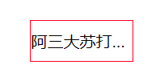
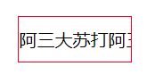

#CSS常用样式和兼容问题
####input相关
```css
/* 苹果input按钮显示异常 */
    input[type=button], 
    input[type=submit], 
    input[type=file], 
    button { cursor: pointer; -webkit-appearance: none; }
    
/* placeholder添加样式 */
    input::-webkit-input-placeholder{
        color: #000;opacity:1;
    }
```

####背景色渐变
>*[参考链接](http://www.runoob.com/css3/css3-gradients.html)*
```css
/* 线性渐变（Linear Gradients）- 向下/向上/向左/向右/对角方向
径向渐变（Radial Gradients）- 由它们的中心定义 */

/* ---左右 */
background: -webkit-linear-gradient(left, red , blue); /* Safari 5.1 - 6.0 */
  background: -o-linear-gradient(right, red, blue); /* Opera 11.1 - 12.0 */
  background: -moz-linear-gradient(right, red, blue); /* Firefox 3.6 - 15 */
  background: linear-gradient(to right, red , blue); /* 标准的语法 */
/* ---对角 */
background: -webkit-linear-gradient(left top, red , blue); /* Safari 5.1 - 6.0 */
  background: -o-linear-gradient(bottom right, red, blue); /* Opera 11.1 - 12.0 */
  background: -moz-linear-gradient(bottom right, red, blue); /* Firefox 3.6 - 15 */
  background: linear-gradient(to bottom right, red , blue); /* 标准的语法 */
```
####文本溢出、隐藏
```css
/* 1.溢出部分显示省率号(固定宽高) */
{
    white-space:nowrap;
    text-overflow:ellipsis;
    overflow:hidden;
}
```

___
```css
/* 2.溢出部分隐藏,但铺满(固定宽高) */
{
    white-space: nowrap;
    word-break: keep-all;
    overflow: hidden;
}
```

___
```css
/* 3.控制行数,溢出部分显示省率号(不能设置固定高度) */
{
    display: -webkit-box;
    -webkit-box-orient: vertical;
    -webkit-line-clamp: 3;
    overflow: hidden;
}
```

___

####去除滚动条
```css
    textarea::-webkit-scrollbar {
        width: 0px;
    }
```

####
####