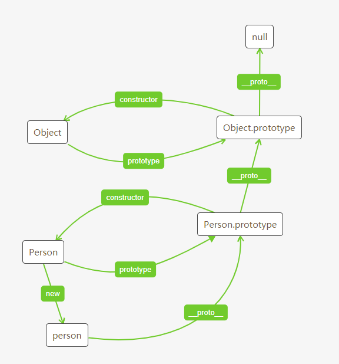

# 面向对象 & 设计模式
>设计模式的定义是：在面向对象软件设计过程中针对特定问题的优雅而简洁的解决方案

# 面向对象

---

## 理解对象
- 创建对象的方式
    - 创建Object实例的方式
    ```js
    var person = new Object()
    person.name = 'gss'
    ```
    - 对象字面量的方式
    ```js
    var person = {
        name: 'vic'
    }
    ```
- 属性类型  Object.defineProperty(),Object.difneProperties(),Object.getOwnPropertyDescriptor(),Object.getOwnPropertyDescriptors()
    - 数据属性
        - configurable:是否可配置,表示能否通过delete删除属性或改变属性的特性或能否改为访问器属性,是不可逆操作(true)
        - enumerbale:是否可枚举(true)
        - writable:是否可写(true)
        - value:即数据值
    ```js
    //自定义设置属性后,如果有不规范的操作(configurable:false时,delete person.name),在严格模式下会抛出异常
    var person = {
        name:'gss',
        age:18
    }
    //获取属性类型
    Object.getOwnPropertyDescriptor(person,'name')
    /*
    {   value: 'gss',
        writable: true,
        enumerable: true,
        configurable: true
    }
    */
    Object.getOwnPropertyDescriptors(person)
    /*
    { 
        name:{ 
            value: 'gss',
            writable: true,
            enumerable: true,
            configurable: true
            },
        age:{
            value: 18,
            writable: true,
            enumerable: true,
            configurable: true
            } 
    }
    */
    //设置属性
    Object.defineProperty(person,'name',{
        configurable:false, //不可删除
        enumerable:false,   //name属性设为不可枚举
        writable:true,      //可重写,此时通过Object.getOwnPropertDescriptor()能看到改变后的那么
    })
    delete person.name      //删除不成功
    person.name= 'vic'      //能设置成功,但不会显示,因为enumerable:false
    /*
        直接打印person: { age: 18 }
        通过getOwnPropertDescriptor:
        { value: 'vic', writable: true, enumerable: false, configurable: false }
    */
    Object.defineProperties(person,{    //设置多个属性
        name:{
            configurable:true,
            enumerable:false,
            writable:true,
            name:'vvv'
        },
        age:{
            writable:false
        }
        
    })
    ```
    - 访问器属性
        - configurable:false
        - enumerbale:false
        - get:undefined
        - set:undefined
    ```js
    var book = {num:200}
    Object.defineProperty(book,'_num',{
        get:function () {
            return this.num
        },
        set:function (value) {
            this.num = value+'set'
        }
    })
    book._num = 100 //注意是_num(_num可以换成任何自定义的名称)
    //book:{ num: '100set' }
    //book._num:100set
    /*
        { 
            num:{
                value: '100set',
                writable: true,
                enumerable: true,
                configurable: true },
            _num:{
                get: [Function: get],   //设置了get或set就默认为访问器属性了
                set: [Function: set],
                enumerable: false,
                configurable: false }
        }
    */
    ```
---

## 创建对象

### 工厂模式
>封装一个函数,内部创建一个对象,为此对象添加属性,返回对象
>缺点:方法不共有,每次都创建新对象,无法识别一个对象的类型
```js
var createObj = function(name,age){
    var o = new Object()
    o.name = name
    o.age = age
    o.getName = function(){
        return this.name
    }
    return o
}
var person1 = createObj('gss',18)
var person2 = createObj('vic',20)
person1 instanceof Object   //true
person1.constructor === Object  //true
```
### 构造函数模式
>可创建特定类型的对象(Person,Super,Sub...)
>通过new 创建实例
>不用new,直接调用:this将指向global对象(浏览器中是window)
>可以用执行函数方法call(obj,op1,op2),apply(obj,[options])
>缺点:构造函数中的方法不是公共的(全是实例属性或方法),每次创建实例都会创建新的方法
```js
var Person = function (name,age,sex) {
    this.name = name
    this.age = age
    this.sex = sex
    this.arr = [1,2]
    this.sayName = function () {    //每次创建实例都是创建Function的实例,如下,所以每次都产生新的方法,没能公用(每定义一个函数,都实例化一个对象)
        console.log(this.name)
    }
    this.getAge = new Function('return this.age')
}
var p1 = new Person('gss',18,'man')
var p2 = new Person('vic',20,'man')
// console.log(p1,p2)
p1.arr.push(3)
console.log(p1.arr) //[1,2,3]   实例属性,不会受影响
console.log(p2.arr) //[1,2]
console.log(p1.getAge())    //18
console.log(p1 instanceof Person)   //true
console.log(p2 instanceof Person)   //true
console.log(p1 instanceof Object)   //true  所有实例都数据Object的实例
console.log(p1.sayName === p2.sayName)   //false
```
### 原型模式
>创建的每个函数都有prototype属性指向这个函数的原型对象(Person.prototype)
>原型对象上的属性和方法都是能被实例共享的
- prototype
    >prototype是一个指针,指向函数的原型对象即Person.prototype
    >所有函数的默认原型都继承自Object的实例
    ```js
    Person.prototype=new Object()   //函数的原型继承自Object的实例
    new Object().__proto__ = Object.prototype   //Object的实例中[[prototype]]指向Object.prototype
    Person.prototype.__proto__ === Object.prototype     //函数的原型中即存在一个[[prototype]]指针指向Object.prototype
    ```
    >Object.__proto__ === null
- constructor
    >是prorotype的默认属性,指向原型对象所属的函数即:Person.prototype.constructor === Person;可手动更改此属性,使其指向其他函数
- [[prototype]] **__proto__**
    >实例的一个指针,在浏览器中用__proto__;指向其构造函数原型对象;即:p1.__proto__ === Person.prototype
- isPrototypeOf()
    >判断实例与原型的关系
    >如果[[prorotype]]指向原型对象,则返回true;即Person.prorotype.isPrototypeOf(p1) //true
    >在继承中:只要是原型链中出现过的原型,都可以说改原型链所派生的实例的原型(都属于实例的原型)
    >可以判断实例是继承哪个原型对象
- instanceof
    >判断实例与构造函数的关系:只要原型链中出现过的构造函数,都会返回true
    >sub instanceof Sub //true
    >sub instanceof Super   //true
    >sub instanceof Object  //true
- Object.getPrototypeOf()
    >返回[[prototype]]的值;即Object.getPrototypeOf(p1) === Person.prototype;Object.getPrototypeOf(p1).name
- hasOwnProperty()
    >判断某个属性是否为实例属性;p1.hasOwnProperty('name') //true
- Object.getOwnPropertyNames()
    >获取所有**实例**属性(可,不可枚举);
    >Object.getOwnPropertyNames(Person.prototype)
    >Object.getOwnPropertyNames(p1)
- in操作符
    >对象能够访问给定属性时,返回true,不论是实例属性还是原型属性
    >'name' in p1 //true
    >'name' in p1 //true
- 原生对象的原型
    >Object.getOwnPropertyNames(Array.prototype)  //[ 'length',
  'constructor',
  'concat',
  'find',
  'findIndex',
  'pop',
  'push',
  'shift',
  'unshift',
  'slice',
  'splice',
  'includes',
  'indexOf',
  'keys',
  'entries',
  'forEach',
  'filter',
  'map',
  'every',
  'some',
  'reduce',
  'reduceRight',
  'toString',
  'toLocaleString',
  'join',
  'reverse',
  'sort',
  'lastIndexOf',
  'copyWithin',
  'fill',
  'values' ]
- 原型图

- 注意
```js
Person.prototype = {
    constructor:Person,//对象字面量形式要把constructor指回构造函数
    name:'gss',
    arr:[1,2]   //引用类型值的改变,会同步给其他实例
}
```
```js
function Person(){}
Person.prototype.name = 'gss'
Person.prototype.arr = [1,2]
Person.prototype.getName = function () {return this.name}
var p1 = new Person()
var p2 = new Person()
console.log(Person.prototype.constructor === Person)    //true
console.log(p1.__proto__ === Person.prototype)  //true
console.log(Object.getPrototypeOf(p1) === Person.prototype) //true
console.log(Person.prototype.isPrototypeOf(p1)) //true
console.log(p1.getName === p2.getName)   //true
console.log(p1.hasOwnProperty('name'))  //false
p1.name = 'vic'
console.log(p1.hasOwnProperty('name'))  //true
console.log(p2.hasOwnProperty('name'))  //false
console.log('name' in p2)   //true
console.log(Object.getOwnPropertyNames(p1)) //['name']
console.log(Object.getOwnPropertyNames(p2)) //[]
console.log(Object.getOwnPropertyNames(Person.prototype))   //[ 'constructor', 'name', 'arr', 'getName' ]
p1.arr.push(3)
console.log(p1.arr,p2.arr)  //[1,2,3],[1,2,3]
```
### 组合构造函数和原型模式
```js
function Person(name,age){
    this.name = name
    this.age = age
    this.arr = [1]
}
Person.prototype = {
    constructor:Person,
    sayName:function () {
        console.log(this.name)
    }
}
var p1 = new Person('gss',18)
var p2 = new Person('vic',20)
console.log(p1.sayName === p2.sayName)  //true
p1.arr.push(2)
console.log(p1.arr,p2.arr)  //[1,2],[1]
```
### 动态原型模式
>节流:如果原型已经初始化,下次就不在初始化
```js
function Person (name){
    this.name = name
    console.log(typeof this.sayName)    //p1时:undefined;p2时:function
    if(typeof this.sayName != 'function'){  //只判断一个属性即可
        Person.prototype.sayName = function () {
            return this.name
        }
        Person.prototype.concat = function () {
            return this.name+'concat'
        }
    }
}
var p1 = new Person('gss')
var p2 = new Person('vic')
```
### 寄生构造函数模式
>就是工厂函数改为构造函数,并在构造函数内加return,改变构造函数的返回值
>应用:创建一个具有额外功能的对象(数组,字符串等)
```js
function SpliceArr(){
    var newarr = new Array()
    newarr.push(...arguments)
    newarr.spliceJoin = function () {
        return this.join('|')
    }
    return newarr
}
var a = new SpliceArr(1,2,3)
console.log(a.spliceJoin()) //1|2|3
```
### 稳妥构造函数模式
>没有公共属性,不引用this,适合在安全环境使用(禁止用this,new)
>和工厂函数的区别是在方法中也不用this,而是,传入什么用什么
```js
function Person(name) {
    var o = new Object()
    var age = 18    //自定义的私有变量
    o.sayName = function () {   //非共享的方法
        return name     //直接用传入的参数,没有用this接受
    }
    o.getAge = function () {
        return age
    }
    return o
}
var p = Person('gss')
console.log(p.sayName())
console.log(p.getAge())
```
---

## 继承
>实现继承主要依靠原型链实现
- 原型链继承
>原型链继承:通过将**父类的实例**赋值给**子类的原型**,这样父类的实例属性都挂在子类原型上,父类原型属性还在父类原型,但子类的原型由于是父类实例,所以有[[prototype]]指向父类原型,即可获得父类原型属性
>此时的属性查找方式就要在加一层:先在子类实例上找,再在子类原型上找,再在父类原型上找
>原型链继承的问题和原型创建对象一样,就是引用类型属性会成为共享属性,挂在子类原型或父类原型
>此时用instanceof判断实例属于哪个构造函数返回为true(只要实例与原型链中出现过的构造函数,都会返回true)
```js
function Super() {
    this.SuperFlag = false
    this.SuperArr = [1]
}
Super.prototype.SuperGetFlag = function () {
    return this.SuperFlag
}
function Sub(){
    this.SubFlag = true
}
Sub.prototype = new Super()
Sub.prototype.SubGetFlag = function () {
    return this.SubFlag
}
var sub = new Sub()
var sub2 = new Sub()
console.log(sub.SubGetFlag())   //true
console.log(sub.SuperGetFlag()) //false
sub.SuperArr.push(1)
console.log(sub.SuperArr,sub2.SuperArr) //[1,1],[1,1]
console.log(Sub.prototype.__proto__ === Super.prototype)    //true
console.log(Sub.prototype.__proto__.constructor === Super)  //true
/*sub实例属性+Sub原型属性(Super的实例)+Super的原型属性 = 继承后实例的所有属性*/
console.log(Object.getOwnPropertyNames(sub))    //[ 'SubFlag' ]
console.log(Object.getOwnPropertyNames(Sub.prototype))  //[ 'SuperFlag', 'SuperArr', 'SubGetFlag' ]
console.log(Object.getOwnPropertyNames(Sub.prototype.__proto__))    //[ 'constructor', 'SuperGetFlag' ]
```
- 构造函数继承
>通过call或apply执行函数,在子类构造函数中执行父类构造函数,改变this指向,传参.但父类原型的属性方法将不会被继承
```js
function Super(name){
    this.name = name
    this.arr = [1]
}
Super.prototype.getName = function () {
    return this.name
}
var sup = new Super('gss')
function Sub(age,name){
    Super.call(this,name)
    this.age = age
}
Sub.prototype.getAge = function () {
    return this.age
}
Sub.prototype.add = function () {
    this.arr.push(1)
}
var sub = new Sub(18,'vic')
var sub2 = new Sub(20,'vic')
console.log(sub.getAge())   //18
console.log(sub2.getAge())   //20
sub.add()
console.log(sub.arr,sub2.arr)   //[1,1],[1]
// console.log(sub.getName())   //undefined     子类不会继承父类的原型属性
console.log(Object.getOwnPropertyNames(Sub.prototype))  //[ 'constructor', 'getAge', 'add' ]
console.log(Sub.prototype.constructor === Sub)  //true
console.log(Sub.prototype === sub.__proto__)  //true
console.log(Object.getOwnPropertyNames(Sub))    //[ 'length', 'name', 'arguments', 'caller', 'prototype' ]
console.log(Object.getOwnPropertyNames(sub))    //[ 'name', 'arr', 'age' ]
```
- 组合继承
>结合原型链和构造函数继承
```js
function Super(name){
    this.name = name
}
Super.prototype.getName = function () {
    return this.name
}
function Sub(age,name) {
    Super.call(this,name)
    this.age = age
}
Sub.prototype = new Super('vic')    //子类原型继承父类实例,问题:会把父类的实例属性挂在子类原型上,和上边call()继承实例属性重复
Sub.prototype.constructor = Sub     //constructor重新指向Sub
Sub.prototype.getAge = function () {
    return this.age
}
var sub = new Sub(18,'gss')
console.log(sub)
console.log(sub.getAge(),sub.getName())
console.log(Object.getOwnPropertyNames(Sub.prototype))  //[ 'name', 'constructor', 'getAge' ]
console.log(Object.getOwnPropertyNames(Super.prototype))    //[ 'constructor', 'getName' ]
console.log(Object.getOwnPropertyNames(sub))    //[ 'name', 'age' ]
console.log(sub.name)   //gss   子类实例上的name
delete sub.name     //删除实例name
console.log(sub.name)    //vic  子类原型上的name(父类实例的name)

function Sub2(age,name){
    Super.call(this,name)
    this.age = age
}
Sub2.prototype = Super.prototype    //直接用父类原型,避免父类实例属性挂在子类原型上
Sub2.prototype.constructor = Sub2
Sub2.prototype.getAge = function () {
    return this.age
}
var sub2 = new Sub2(19,'ggg')
console.log(sub2)
console.log(sub2.getAge(),sub2.getName())
console.log(Object.getOwnPropertyNames(Sub2.prototype))     //[ 'constructor', 'getName', 'getAge' ]
console.log(Object.getOwnPropertyNames(sub2))   //[ 'name', 'age' ]
console.log(sub2.name)  //gss
delete sub2.name
console.log(sub2.name)  //undefined
```
- 原型式继承
>借助原型可以基于已有的对象创建新对象(在新对象的原型上继承已有对象的属性)
>内部借助构造函数
```js
function object(o){     //es6中用Object.create()规范了此写法
    function F(){}      //内部定义一个构造函数
    F.prototype = o     //构造函数的原型接受(继承)传入的对象o
    return new F()      //返回否早函数的实例
}

var obj = {
    name:'qq',
    arr:[1]
}
var fo = object(obj)
console.log(fo,fo.name,fo.arr)  //fo是{},因为没有实例属性,obj的属性在[[prototype]]上
console.log('--------------')

var o = Object.create(obj)  //可以理解为继承一个对象, 添加的属性是在原型下
console.log(o)  //{}
console.log(o.__proto__)    //{ name: 'qq', arr: [ 1 ] }
console.log(o.name,o.arr)   //qq [ 1 ]
var o2 = Object.create(obj,{name:{value:'kk'}}) //属性吗描述符不写默认为false
console.log(o2) //{}
console.log(o2.name,o2.arr) //kk [ 1 ]
o.name = 'oo'
o.arr.push(2)
o2.name = 'll'  //不可写,不可枚举,不可配置
console.log(o.name,o.arr,o2.name,o2.arr)    //oo [ 1, 2 ] kk [ 1, 2 ]
console.log(Object.getOwnPropertyNames(o2)) //['name']  说明添加的属性是实例属性,只是没有设置可枚举

// Object.create()实现继承
function Super(name) {
    this.name = name
}
Super.prototype.getName = function () {
    return this.name
}
function Sub(name){
    Super.call(this,name)
}
Sub.prototype = Object.create(Super.prototype,{age:{value:19}}) //如果是构造函数的话(子类),需要用原型接收,因为Obejct.create()创建的是目标对象的[[prototype]],也就是子类实例的__proto__即子类原型对象
Sub.prototype.constructor = Sub
var s = new Sub('gss')
console.log(s.name,s.getName(),s.age)     //gss,gss,19
console.log(Object.getOwnPropertyNames(s.__proto__))    //[ 'age', 'constructor' ],age是在[[prototype]]上的,因为直接用子类构造函数的原型接收了
console.log(s instanceof Sub)       //true
console.log(s instanceof Super)     //true  原型链上出现过的构造函数都会返回true
```
---

## 单例模式

## 观察者模式(发布-订阅模式)


