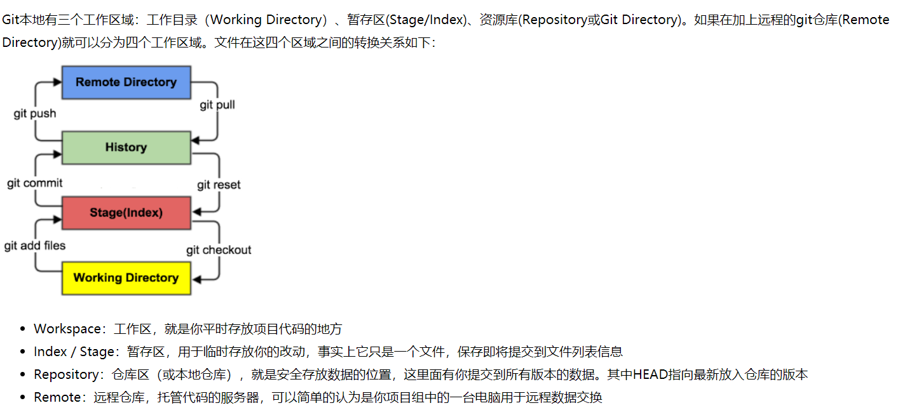
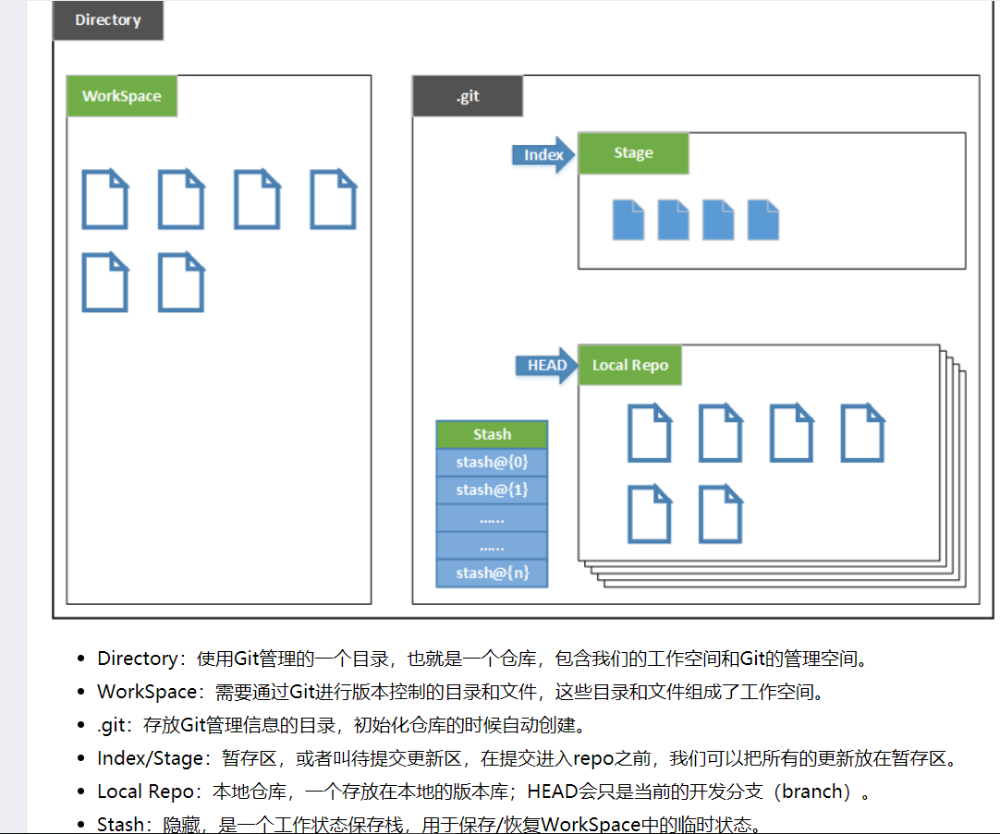
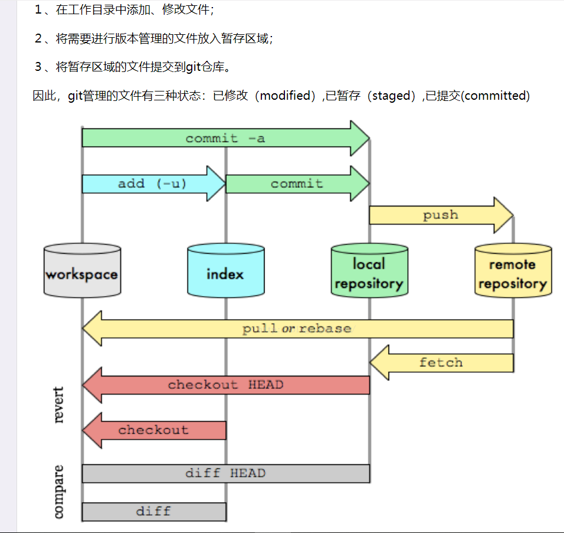

# Git教程及常用操作
## 相关连接
- [廖雪峰](https://www.liaoxuefeng.com/wiki/896043488029600)
- [一小时学会git](https://www.cnblogs.com/best/p/7474442.html)
- [git stash](https://blog.csdn.net/qq_36898043/article/details/79431168)

### 常用指令
```
git不能输入中文设置:右键黑框,options --> text --> local 中文 utf-8
~   home（windows是当前用户所在目录）
cd  改变目录
    cd ~    到home目录
    cd d:/  切换盘符
    cd ..   去上一层
pwd 当前所在路径
ls  目录中所有文件
ll  同上(更详细)
touch   新建文件
    touch 1.js
mkdir   新建目录
    mkdir 1
rm  删除文件
rm -r   删除文件夹
mv  移动文件
    mv 1.js 1   把1.js移动到目录1下
cat 显示文件内容
    cat 1.txt   (其他文件不一定有效)
echo    输出
    echo 111    输出到命令行
    echo 111 >> 1.txt   输出到文件,>>表示追加
    echo 222 > 1.txt    输出到文件,>表示覆盖
vim [file]      编辑文件
    i       进入输入模式
    esc     命令模式
    :q!     不保存退出
    :wq     保存退出
history     输入的命令的历史
```
### git配置项
```
git config --list   查看配置项(global)
git config --system --list  系统配置项;(global,local)
git config --global user.name "shoushuaiGu"
git config --global user.email "shoushuaiGu@163.com"
```
### 图解本地仓库和工作流程
#### 工作区域

#### 本地仓库

#### 工作流程

### git文件操作
#### 文件的四种状态
- untracked     未追踪（新填入的文件）
- unmodified    没有变动的（未更改的，不需要任何操作的）
- modified      有改变的（需要add和commit的，checkout放弃更改）
- staged        已暂存的（未commit的）
#### 操作指令
- 不确定总结
```
--cached    表示操作暂存区
HEAD        表示操作repo(仓库)
```
- 工作区相关操作
```
git init
git init 111/   指定初始化111文件夹
git status [filename]   文件状态
git log                 提交历史
git reflog              所有的分支的所有更新记录,包括撤销的更新
git clean [options]     删除所有未跟踪的文件(options:-df,-d(表示包含目录),-f(表示强制清除))
git rm [file]   删除文件的同时从暂存区删除
git mv a.txt b.txt  改名(这种改名会标记状态为modified,如果直接重命名会成为未跟踪文件)
```
- 暂存区相关操作
```
git add [file1] [file2] [dir] .     添加到暂存区(单个多个文件,文件夹,.所有)
git rm --cached [file]  把文件从暂存区删除(文件变成未被追踪状态,但修改的内容还在,相当于只是更改状态为untracked)
git checkout [file]     将暂存区指定或全部文件覆盖工作区
```
- 仓库相关操作(repo)
```
git reset head [file]   暂存区的目录树会被重写，被 master 分支指向的目录树所替换，但是工作区不受影响(即commit后的指向覆盖暂存区的指向)
git checkout head [file]    用 HEAD 指向的 master 分支中的全部或者部分文件替换暂存区和以及工作区中的文件
```
- 比较文件差异
```
git diff    查看文件修改后的差异
git diff --cached   暂存区与已提交的文件差异
git diff HEAD
```
- 检出操作
```
git checkout    显示工作区、暂存区与HEAD的差异
git checkout [branch]     切换分支(更新HEAD以指向branch分支，以及用branch  指向的树更新暂存区和工作区)
git checkout [file] || .     用暂存区文件覆盖本地文件
git checkout [branch] [file]    用branch中已提交的文件,替换暂存区和工作区中相应的文件
```
- 提交相关
```
git commit -m [msg]     提交暂存区到仓库
git commit [file] [file2] -m [msg]  指定文件提交
git commit -a       提交最新变化,省掉add;对未追踪文件无效(会进入vim输入模式,填写msg,保存退出即可)
git commit -v       提交时显示所有diff信息,操作同上
git commit --amend -m [msg]     代码没有变化时，只更改上次提交的msg
git commit --amend [file] [file]       重做上一次提交并指定文件的新变化
git reset --hard head~n     撤回上n次提交，工作区，暂存区都会恢复（文件是n次前已提交的状态）
git reset --hard head^      ^当前版本；^^前一版本
git reset --hard head@{n}   n通过 git reflog可查看
git reset --[commit-id]     同上
git revert [commit-id]      回滚修改，同时文件状态为modified
```
- 删除文件
```
rm [file]      删除未跟踪文件
git rm -f [file]    删除已提交文件,会有删除记录
git rm --cached [file]  删除暂存区文件
```
- 忽略文件
```
配置.gitignore文件
#           为注释
*.txt       #忽略所有 .txt结尾的文件
!lib.txt    #但lib.txt除外
/temp       #仅忽略项目根目录下的TODO文件,不包括其它目录temp
build/      #忽略build/目录下的所有文件
doc/*.txt   #会忽略 doc/notes.txt 但不包括 doc/server/arch.txt
```
### 分支
#### 操作指令
```
git branch      所有本地分支
git branch -r   所有远程分支
git branch -a   所有本地,远程分支
git branch [branch-name]    新建分支,不切换
git branch [branch] [commit-id]     新建分支,指向指定commit
git checkout -b [branch-name]   新建分支并切换
git checkout -b [branch] [remote-name]/[branch]     在远程主机某个分支的基础上创建新分支
    git checkout -b dev origin/master
git branch --track [branch] [remote-branch]     新建分支与指定远程分支联系
git checkout [branch]   切换分支,跟新工作区
git checkout -          切换上一个分支
git branch --set-upstream [branch] [remote-branch]      在现有分支与指定分支建立联系
git push --set-upstream origin [branch]     本地分支与远程分支建立关联并推送
git merge [branch]      合并指定分支到当前分支
git merge [remote-name]/[branch]    合并远程主机分支到当前分支
    git merge origin/master
git rebase [remote-name]/[branch]   同上
git branch -d [branch]      删除分支
git push origin --delete [branch]       删除远程分支
git branch -dr origin/dev       删除远程分支dev(-d:删除,-r:远程)
```
### 远程仓库操作
#### 指令
```
[remote-name]           远程主机(origin,通常只有一个,此时命令中可省略)
git clone [url] [dir]       克隆到指定目录
git clone -o [remote-name] [url]    克隆时默认主机名为origin;-o [自定义主机名]更改主机名
git remote                  远程主机名(origin)
git remote -v               远程主机的网址
git remote show [remote-name]       显示主机详细信息
git remote add [remote-name] [url]  添加远程主机
git remote rm [remote-name]         删除远程主机
git remote rename [old-remote-name] [new-remote-name]   重命名远程主机
git fetch           获取远程所有主机所有分支所有更新(只拉去更新不合并)
git fetch [remote-name]     获取远程某个主机的所有分支更新
git fetch [remote-name] [branch]    获取某个分支的更新
git checkout -b [branch] [remote-name]/[branch]     在远程主机某个分支的基础上创建新分支
    git checkout -b dev origin/master
git merge [remote-name]/[branch]    合并远程主机分支到当前分支
git rebase [remote-name]/[branch]   同上
git pull [remote-name] [remote-branch]:[local-branch]       获取远程某分支更新并合并到指定本地分支
git pull [remote-name] [remote-branch]          获取远程分支更新并合并到当前分支
git push [remote-name] [branch] [remote-branch]     推送本地分支更新到远程指定主机指定分支
git push --all [remote-name]        将本地所有分支推送到远程
```

