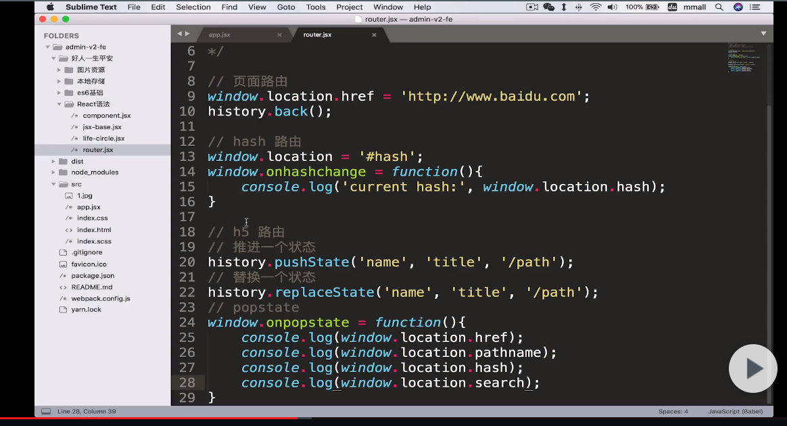

#javascript代码段
## [js初中高知识体系](https://www.cnblogs.com/hongqin/category/898509.html)
####JQ相关
>$.proxy方法
>>改变this指向
```html
<button>执行 test 函数</button>
<p></p>
```
```javascript
var Person = {
    name: "John Doe",
    age: 32,
    test: function(){
        $("p").after("Name: " + this.name + "<br> Age: " + this.age);
    }
};
$("button").click($.proxy(Person,"test"));  //test能拿到name,age.方法正常执行
$("button").click(function(){Person.test()});   //同上(异步函数如定时器等加function(){},确保this指向)
$("button").click(Person.test); //this指向$("button")
```
>$.noop == function(){} 一个空函数

####export | export default | module.exports | exports
>export | export default  : es6语法  用import * from * 引入
```javascript
// export   各个导出,必须有变量名,引入时变量名必须对应一致,import {name} from *.js,import * as obj from *.js
export const a = 1;     import {a} from '*.js';

const a =1;const fn = function(){};
export {fn,a};      import {fn,a} from '*.js';
                    import * as obj from '*.js';    //obj.a  obj.fn()
// export default   只能出现一次,可以没有变量名,引入时没有{},变量名能自定义
function fn(){};
export default fn;  import f from '*.js';
export default {data:"victor"};     import d from '*.js';   //d.data
export default const a=12;//不能这样写
```
>module.exports | exports : Commonjs语法规范
```javascript
// 这两个就用module.exports就好了
// 能用 . 和=直接导出.  require引入,不用{}
//可以看成var exports = module.exports;所以exports = a;是错的
const a = 1;
module.exoprts = a;     var aa = require('*.js');   //aa==1
module.exports.aa = a;  var obj = require('*.js');  //obj.aa==1
```

####关于浏览历史和返回跳转

```javascript
document.referrer   //获取当前页面的上一页面
location.replace('/*.html')     //跳转某页,不发通过浏览器返回按钮返回
/* 控制返回跳转 */
pushHistory(); 
window.addEventListener("popstate", function(e) { 
    // 监听浏览器的返回按钮事件;
    // 根据自己的需求实现自己的功能 
    location.href='/fuwuhao/index.php/Home/Easy/index';
}, false); 

function pushHistory() { 
    var state = { 
        title: "title", 
        url: "#"
    }; 
    window.history.pushState(state, "title", "#"); 
} 
```

####监听加载状态改变
```javascript
document.onreadystatechange = completeLoading;
function completeLoading() {
    if (document.readyState == "complete") {
        
    }
}
```

####cookie的操作
```javascript
// 获取
function getCookie(name){
    var arr,reg=new RegExp("(^| )"+name+"=([^;]*)(;|$)");
    if(arr=document.cookie.match(reg))
        return unescape(arr[2]);
    else
        return null;
}

// 设置
document.cookie="name="+username;   //默认方式

function setCookie(name,value,time){
    var strsec = getsec(time);
    var exp = new Date();
    exp.setTime(exp.getTime() + strsec*1);
    document.cookie = name + "="+ escape (value) + ";expires=" + exp.toGMTString();
}
function getsec(str){
    // alert(str);
    var str1=str.substring(1,str.length)*1;
    var str2=str.substring(0,1);
    if (str2=="s"){
        return str1*1000;
    }
    else if (str2=="h"){
        return str1*60*60*1000;
    }
    else if (str2=="d"){
        return str1*24*60*60*1000;
    }
}
// 调用
//s20是代表20秒
//h是指小时，如12小时则是：h12
//d是天数，30天则：d30
//setCookie("name","hayden","s20");

// 删除
function delCookie(name){
    var exp = new Date();
    exp.setTime(exp.getTime() - 1);
    var cval=getCookie(name);
    if(cval!=null)
    document.cookie= name + "="+cval+";expires="+exp.toGMTString()+"; path=/";
}
```

####判断是否为微信浏览器
```javascript
    function isWeiXin(){ 
        var ua = window.navigator.userAgent.toLowerCase(); 
        if(ua.match(/MicroMessenger/i) == 'micromessenger'){ 
            return true; 
        }else{ 
            return false; 
        }
    } 
```

####编码转码
```javascript
    encodeURI("http://cang.baidu.com/do/s?word=百度&ct=21");
    // "http://cang.baidu.com/do/s?word=%E7%99%BE%E5%BA%A6&ct=21"
    decodeURI("http://cang.baidu.com/do/s?word=%E7%99%BE%E5%BA%A6&ct=21")
    // "http://cang.baidu.com/do/s?word=百度&ct=21"
```
####input表单验证

```html
<!-- 只能输入数字 -->
<!-- \w是数字,字母,下划线;\W是与之相反的所有 -->
<!-- onkeypress是按数字键事件 -->
 <el-input class="add-moc-input" maxlength="11" v-model.trim="addMocForm.dealerTelephone" onKeyUp="value=value.replace(/[\W\_a-zA-Z]/g,'')" onkeypress="return (/[\d]/.test(String.fromCharCode(event.keyCode)))" placeholder="请输入"></el-input>
```
---
####各种遍历
>普通for循环
>- for循环中的i在循环结束之后任然存在与作用域中，为了避免影响作用域中的其他变量，使用函数自执行的方式将其隔离起来()();
>- 避免使用for(var i=0; i<demoArr.length的方式，这样的数组长度每次都被计算，效率低于上面的方式。也可以将变量声明放在for的前面来执行，提高阅读性
```javascript
    (function(){
        for(i=0,len=arr.length,i<len,i++){}
    })()
```
>foreach
>- forEach方法与map方法很相似，也是对数组的所有成员依次执行参数函数。但是，forEach方法不返回值，只用来操作数据。也就是说，如果数组遍历的目的是为了得到返回值，那么使用map方法，否则使用forEach方法。forEach的用法与map方法一致，参数是一个函数，该函数同样接受三个参数：当前值、当前位置、整个数组。
```javascript
    arr.foreach(function(el,index,arr){})
```
>.map
>- map方法将数组的所有成员依次传入参数函数，然后把每一次的执行结果组成一个新数组返回。
    注意：是返回一个新数组，而不会改变原数组。
>- map方法接受一个函数作为参数。该函数调用时，map方法向它传入三个参数：当前成员、当前位置和数组本身。
>- 此外，map()循环还可以接受第二个参数，用来绑定回调函数内部的this变量，将回调函数内部的this对象，指向第二个参数，间接操作这个参数（一般是数组）。
```javascript
    var num = [1,2,3];
    var arr = num.map(function(el,index,arr){
        return el+1;
    })
    
    arr     //[2,3,4]
    num     //[1,2,3]
    // 第二个参数,改变this指向
    var num = [1,2];
    var str = ['一','二','三']
    var arr = num.map(function(el,index,arr){
        return this[el]
    },str)
    arr     //['二','三']
```
>for ... in
>- 一般用来遍历对象
```javascript
    var obj = {name:'gss',age:18};
    for(var item in obj){
        // if(obj.hasOwnProperty(item)){    //如果继承的属性是可遍历的，那么就会被for...in循环遍历到。但如果只想遍历自身的属性，使用for...in的时候，应该结合使用hasOwnProperty方法，在循环内部判断一下，某个属性是否为对象自身的属性。否则就可以产生遍历失真的情况
            console.log(item);//name age    键(数组中是索引)
            console.log(obj[item]);//gss 18    值
        // }
    }

```
>for ... of
[链接](https://www.cnblogs.com/m2maomao/p/7743143.html)
for...of 语句创建一个循环来迭代可迭代的对象。在 ES6 中引入的 for...of 循环，以替代 for...in 和 forEach() ，并支持新的迭代协议。for...of 允许你遍历 Arrays（数组）, Strings（字符串）, Maps（映射）, Sets（集合）等可迭代的数据结构等。
<span style="color:red">注意:var obj = {a:1,b:2}这种对象不能用for...of,能用for...in.因为他不是iterable类型(array,set,map)</span>

```javascript
// string,arr
var arr = ['aa','bbb','ccc','ddd'];
var str = 'abcdef'
for(var v of arr){
    console.log(v);
}
for(var v of str){
    console.log(v);
}
// Maps(映射)
// Map 对象就是保存 key-value(键值) 对。对象的原始值可以用作 key(键)或 value(值)。Map 对象根据其插入方式迭代元素。换句话说， for...of 循环将为每次迭代返回一个 key-value(键值) 数组。
const mapsData = new Map([['one',1],['two',2]])
console.log(mapsData);  //Map { 'one' => 1, 'two' => 2 }
for(const [key,value] of mapsData){
    console.log(key);   //one   two
    console.log(value); //1     2
    
}
// Set(集合)
// Set(集合) 对象允许你存储任何类型的唯一值，这些值可以是原始值或对象。可用于数组去重
// Set(集合) 对象只是值的集合。 Set(集合) 元素的迭代基于其插入顺序。 Set(集合) 中的值只能发生一次。如果您创建一个具有多个相同元素的 Set(集合) ，那么它仍然被认为是单个元素。
const setData = [...new Set([1,2,3,3,2,1])];    //[1,2,3]
const setData = new Set([1,2,3,3,2,1]);
for(const v of setData){
    console.log(v); 
    //1
    //2
    //3
}
// function的arguments
function test(){
    for(const ags of arguments){
        console.log(ags);
        
    }
}
test(1,2,3,4)

//generators(生成器)
function* gen(){
    yield 1
    yield 2
    yield 3
}
for(const v of gen()){
    console.log(v);
    //1
    //2
    //3
}

```
[生成器](https://www.liaoxuefeng.com/wiki/1022910821149312/1023024381818112)
```javascript
// 退出迭代
break
return
continue
throw
```


>filter
>-  filter方法用于过滤数组成员，满足条件的成员组成一个新数组返回。它的参数是一个函数，所有数组成员依次执行该函数，返回结果为true的成员组成一个新数组返回。该方法不会改变原数组。
>-  filter方法用于过滤数组成员，满足条件的成员组成一个新数组返回。它的参数是一个函数，所有数组成员依次执行该函数，返回结果为true的成员组成一个新数组返回。该方法不会改变原数组。
>- 此外，filter方法也可以接受第二个参数，用来绑定参数函数内部的this变量。
```javascript
    var arr = [1,2,3,4];
    var arrFilter = arr.filter(function(el,index,arr){
        return el%2==0
    })
    arrFilter   //[2,4]
    var obj = {max:3}
    var arrFilter2 = arr.filter(function(el,index,arr){
        return el<=this.max
    },obj)
    arrFilter2  //[1,2,3]
```
>some every
>- 这两个方法类似“断言”（assert），返回一个布尔值，表示判断数组成员是否符合某种条件。
    它们接受一个函数作为参数，所有数组成员依次执行该函数。该函数接受三个参数：当前成员、当前位置和整个数组，然后返回一个布尔值。
>- some方法是只要一个成员的返回值是true，则整个some方法的返回值就是true，否则返回false。
>- 而every方法则相反，所有成员的返回值都是true，整个every方法才返回true，否则返回false。两相比较，some()只要有一个是true，便返回true；而every()只要有一个是false，便返回false.
```javascript
    var arr = [1,2,3]
    var bool = arr.some(function(el,index,arr){
        return el>1
    })
    var bool2 = arr.every(function(el,index,arr){
        return el>1
    })
    console.log(bool);  //true
    console.log(bool2); //false
```
>reduce()和reduceRight
>- reduce方法和reduceRight方法依次处理数组的每个成员，最终累计为一个值。它们的差别是，reduce是从左到右处理（从第一个成员到最后一个成员），reduceRight则是从右到左（从最后一个成员到第一个成员），其他完全一样。
>- reduce方法和reduceRight方法的第一个参数都是一个函数。该函数接受以下四个参数。
    累积变量，默认为数组的第一个成员
    当前变量，默认为数组的第二个成员
    当前位置（从0开始）
    原数组
    这四个参数之中，只有前两个是必须的，后两个则是可选的。
>- 如果要对累积变量指定初值，可以把它放在reduce方法和reduceRight方法的第二个参数。
```javascript
    var arr = [1,2,3,4,5];
    var he = arr.reduce(function(a,b,i,arr){
        console.log(a, b)
        return a+b
    })
    // 1 2
    // 3 3
    // 6 4
    // 10 5

    he  //15
    var arr = [1,2,3,4,5];
    var he = arr.reduce(function(a,b,i,arr){
        return a+b
    },10)
    he  //25
    var str = ['aa','bbb','ccc','dddd']
    var lengthMax = str.reduce(function(a,b){
        return a.length>b.length?a:b
    })
    lengthMax   //'dddd'
```
>Object.keys()遍历对象的属性
```javascript
    var obj = {
        p1: 123,
        p2: 456
    };
    Object.keys(obj)    //['p1','p2']
```
>Object.getOwnPropertyNames()遍历对象的属性
>- Object.getOwnPropertyNames方法与Object.keys类似，也是接受一个对象作为参数，返回一个数组，包含了该对象自身的所有属性名。但它能返回不可枚举的属性。
```javascript   
var a = ['Hello', 'World'];
 
Object.keys(a) // ["0", "1"]
Object.getOwnPropertyNames(a) // ["0", "1", "length"]
```
>while(){}   do{}while()
```javascript
var i = 0;
while(i<10){
    console.log(i);
    i++
}

do{
    console.log(i);
    i++
}while(i<10)
```
<span style="color:red;">以上循环特征（相同与不同）：</span>
1.foreach，map，filter循环中途是无法停止的，总是会将所有成员遍历完。
2.他们都可以接受第二个参数，用来绑定回调函数内部的this变量，将回调函数内部的this对象，指向第二个参数，间接操作这个参数（一般是数组）。
3.map方法不会跳过undefined和null，但是会跳过空位。forEach方法也会跳过数组的空位，for和while不会。
```javascript   
    var f = function (n) { 
        return 'a' 
    }; 
 
    [1, undefined, 2].map(f) // ["a", "a", "a"] 
    [1, null, 2].map(f) // ["a", "a", "a"]
    [1, , 2].map(f) // ["a", , "a"]
```

---
####Map,Set,generators
[ES6](http://es6.ruanyifeng.com/#docs/set-map)
####面试相关
- [浅谈setTimeout与Promise](https://juejin.im/post/5b7057b251882561381e69bf)
    - 异步执行,与任务队列相关,settimeout只等定时的时间结束执行一次,promise确保在内的所有异步完成才返回
- [内存泄露,溢出](https://blog.csdn.net/Judy_qiudie/article/details/82845692)
    - 泄露原因
        - 全局变量引起的:储存大数据时要即使置空或销毁
        - 闭包:匿名函数访问父级变量
        - dom清空或删除时,事件没关闭清除
        - 计时器没关闭
    - 如何不免
        - 减少全局变量使用或生命周期较长的对象,即使清理无用的变量数据
        - 注意循环逻辑,避免死循环
        - 避免创建过的对象.不用的即使回收
- call和apply
    - 都是改变this指向,只是传参形式不同
        - apply只有两个参数,新的thisObj和arguments数组
        - call可以多个参数,新的thisObj和每个参数单独传入
    - 用于继承
    ```javascript
    function animate(name,age){
        this.name = name;
        this.age = age
    }

    function an(name,age){
        animate.apply(this,[name,age])
    }
    ```
- 判断是数组
    - arr instanceof Array  //true
    - arr.__proto__.constructor == Array  //true
    - Object.prototype.toString.call(o)== '[object Array]'; //true
- 多维数组降维
```javascript
var arr = [1,2,[3,4,[5,6]]]
// join+split
arr.join(',').split(',')    //缺点:如果是数字,会变成字符串

[].concat.apply([],arr)     //用concat+apply,把多维数组当参数传入;缺点:只能用于二维数组

// 用递归
let result = [],
function unid1(arr){
    for(let item of arr){
        if(Object.prototype.toString.call(item).slice(8, -1)==='Array'){
            unid1(item);
        }else{
            result.push(item);
        }
    }
    return result;
}

```
- [arr.from](https://www.cnblogs.com/jf-67/p/8440758.html)

- 原型,原型链   [简书](https://www.jianshu.com/p/ddaa5179cda6)

- [继承](https://segmentfault.com/a/1190000016441558)

- 闭包 [通俗讲解](https://blog.csdn.net/coder_vader/article/details/78839686)
    - 删除闭包中的变量或清空闭包
        - 在闭包内返回一个方法,使变量=null
        - 直接将闭包函数=null
- [js设计模式](https://blog.csdn.net/song_mou_xia/article/details/80763833)
    - [资料](https://blog.csdn.net/qq_42564846/article/details/81583342)
- [promise原理](https://blog.csdn.net/sinat_17775997/article/details/83376452)
    - [资料](https://www.jianshu.com/p/f77d8c61c69a)
    - [资料](https://www.jianshu.com/p/b4f0425b22a1)
####
