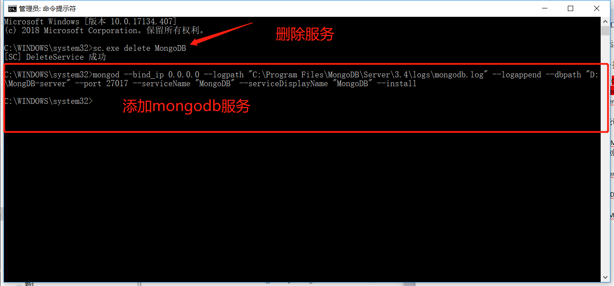
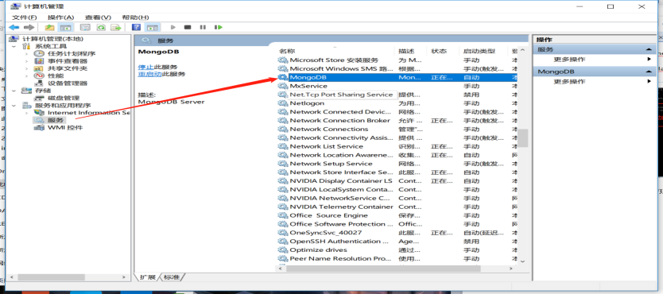
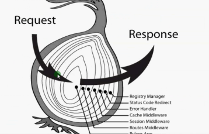

#Node常用模块和相关知识

####常用模块
>font-spider 字蛛使用(提取用到的字体到一个文件,减小字体包大小)
* 安装font-spider模块
* 在字体文件夹（font）运行以下命令(路径为html文件路径) 
* font-spider C:\Users\yanyikeji\Desktop\work\calendar-1.3\*.html
* 运行结束后，会在font文件夹中生成压缩提取后的字体
>安装cnpm
* npm install -g cnpm --registry=https://registry.npm.taobao.org

####Node原生
>基本形式
```javascript
var http = require("http");
var server = http.createServer(function(req,res){
    res.send("hello node")
})
server.listen(3000,'127.0.0.1');
```
>http模块
```javascript
// 设置状态码
res.writeHead(200,{"Content-type":"text/html;charset='utf-8'"});
res.write('hello node');
res.end()

```
>url模块
```javascript
//解析url地址
var data = req.url; //news?id=10&type=person
Url.parse(data,true);   //通过url模块解析成对象形式

```
>热更新插件
* npm -g install supervisor
* supervisor *.js   //启动js文件
>fs模块
>>  <font color=#f02 size=3 face="STCAIYUN">注意:fs操作都是异步,涉及到循环需要自执行函数或promise</font>
```javascript
fs.stat(path,(err,stats)=>{
    let a = stats.isFile();     //是否文件
    let b = stats.isDrectory(); //是否目录
})
fs.mkdir        //创建目录
fs.writeFile    //创建写入文件
fs.appendFile   //追加文件
fs.readFile     //读取文件
fs.readdir(path,[cb(err.files)])    //读取目录
fs.rename       //重命名(剪切)
fs.rmdir        //删除目录
fs.unlink       //删除文件
fs.createReadStream(path)   //创建读取流
fs.createWriteStream(path)  //创建写入流
readstream.pipe(writeStream)    //管道读写
```
>events模块  
>>事件驱动    广播和接收广播
```javascript
<!-- 类似webSocket -->
var eventEmitter = new events.EventEmitter();   //创建实例
eventEmitter.on(eventname,(data)=>{});   //监听广播
eventEmitter.emit(eventname,data);  //发送广播
```
####MongoDb数据库
```
mongo 127.0.0.1:27017  链接(远程)数据库
show dbs 查看数据库列表
use dbName 使用/创建数据库(创建数据库需要成功插入数据后才算创建成功)
show collections   查看数据表
db.collectionName.insert({"name":"victor"}) 在某个表内插入数据
```
>find
```
db.cName.find() 查找全部
db.cName.find({age:{$gt:20}}) 查找大于20的
db.cName.find({age:{$lt:20}) 小于 gte:>=;lte:<=
db.cName.find({age:{$gt:20,$lt30}}) 
db.cName.find({title:/文章/}) 模糊搜索包含"文章"的
db.cName.find({title:/^文章/}) 一文章开头的
db.cName.find({"age":{$gte:20,$lte:30},{"age":1}})	只返回符合条件的age字段的数据,添加{"name":"victor'}就可增加字段
db.cName.find().sort({age:1}) 1升序 -1降序
db.cName.find.skip(2).limit(3) 分页查询:跳过两条查3条
db.cName.find({$or:[{age:20},{age:24}]})	20或者24的
db.cName.findOne()==db.cName.find().limit(1) 查询第一条数据
db.cName.find({age:50}).count() 查询数据数量
```
>修改/删除
```
<!-- 修改 -->
db.cName.update({"name":"zs"},{$set:{"age":35}})	更改姓名位zs的年龄为35
db.cName.update({"name":"zs"},{"age":20})  不写$set的话是zs这条数	据整条修改为{"age":20}
<!-- 删除 -->
db.cName.drop()    删除表
db.cName.remove({name:"zs"})   删除姓名的所有
db.cName.remove({"name":"zs"},{justOne:true})	删除一条
db.cName.remove({"name":"zs","age":20})	删除zs且年龄20的
```
>索引(提高搜索速度)
```
db.cName.getIndexes()	查看索引
db.cName.ensureIndex({name:1})  给name字段设置索引
db.cName.dropIndex({name:1})   删除name字段索引
db.cName.find().explain("executionStats")  显示查询时间
db.cName.ensureIndex({"name":1,"age":-1})	复合索引(联合索引):正负1表示升序降序
db.cName.ensureIndex({"id":1},{"unique":true})		唯一索引:保证插入的数据id不能重复
db.cName.ensureIndex({"id":1,No:-1},{"unique":true}})		复合唯一索引
```
>Windows上设置mongodb服务器自动启动
  1. 需要将启动mongodb添加到”服务”中去.
  1. 管理员身份运行cmd
  1. 在其中输入mongod --bind_ip 0.0.0.0 --logpath "C:\Program Files\MongoDB\Server\3.4\logs\mongodb.log" --logappend --dbpath "D:\MongDB-server" --port 27017 --serviceName "MongoDB" --serviceDisplayName "MongoDB" --install
     1. ip:0.0.0.0表示任何ip都能访问
     1. 软件安装位置:C:\Program Files\MongoDB\Server\3.4\logs\mongodb.log
     1. 其中logs\mongodb.log	是手动创建的文件夹和文件,用来打印日志
     1. 开启服务位置:D:\MongDB-server
     1. 服务名称: serviceName "MongoDB" 
     1. 显示名称:serviceDisplayName "MongoDB"
   
   1. 运行后,在计算机管理--服务中找到MongoDB右键启动即可
   
####Node操作数据库(3.x)
>[3.x版本文档](http://mongodb.github.io/node-mongodb-native/3.0/quick-start/quick-start/)
[2.x版本文档](http://mongodb.github.io/node-mongodb-native/2.2/quick-start/quick-start/)
<font color=#f02>数据库操作都是异步</font>
1. 安装
    npm i mongodb@3.x -D
2. 引入
    ```javascript
    var MongoClient = require('mongodb').MongoClient;
    ```
3. 链接数据库
    ```javascript
    var url='mongodb://127.0.0.1:27017'
    //{useNewUrlParser:true}是链接本地mongodb地址解析错误时加的
    MongoClient.connect(url,{useNewUrlParser:true},(err,client)=>{
        const db = client.db(dbName);	//通过client和数据库名获 取db对象
        var list = [];
        Let res = db.collection(cName).find();
        res.toArray((err,docs)=>{
            Clg(docs);	//查询到的数据数组
            list.push(docs);
        })
    })
    insertOne()	    //插入数据
    insertMany()    //插入数据(其他操作也都有Many方法)
    updateOne({},{$set:{}})		//改
    deleteOne({})   //删
    ```
___
####Koa+ES6
>ES6
```javascript
`字符串拼接数据${data}`     // 字符串拼接

let P = new Promise((resolve,reject)=>{     //promise
    if(succes){
        resolve()
    }else{
        reject()
    }
})
P.then(res=>{}).catch(err=>{})

/**
async await
async标记函数为异步,返回promise,可以用promise的方式.then()处理回调
await必须在async或者返回值是promise对象中使用
可以在最外层加async以确保函数内能用await
*/
async function setName(){
    return 'victor';
}
async function getName(){           //最外层async
    let name = await setName();     //处理异步
    console.log(name);              //打印异步获取的值
}
getName()                           //victor
```
>koa路由 koa-router
```javascript
1. 引用	
    const Koa = require('koa');
    const app = new Koa();
    const router = require('koa-router')();
2. 配置
    router.get('/',async(ctx,next)=>{	//ctx对象包含req,res的上下文对象
        ctx.body='首页'
    }).get('/news',async(ctx,next)=>{})	//链式写法
3. 启动路由
    app.use(router.routes())		//启动
    app.use(router.allowedMethods())     //自动添加响应头
4. 获取get方式的参数
    let data = ctx.query;   
5. 动态路由
    router.get('/news/:nid/:page',async (ctx,next)=>{
        let data = ctx.params;  //动态路由参数
    })
    // 地址栏输入http://localhost:3000/news/a/3
    // data = {nid:a,page:3}
6. 重定向
    router.get('/news',async (ctx,next)=>{
        let username = ctx.cookies.get('username')||'';
        if(!username){
            ctx.redirect('/?code=0');	//cookie过期定向到首页,可以带些参数
            return;
        }
        ctx.body = username;
    })

    router.redirect('/o', '/'); //存疑
    router.all('/p',ctx=>{		//存疑
        ctx.redirect('/');
        ctx.status = 301;
    })
7. 路由模块化
    一般分为admin后台管理、web前端页面、api接口三大模块
    每个模块下又分很多小模块(user、news... )
    1. 创建routers文件夹存放模块(如:admin.js)
    ```
    admin.js
        var router = require('koa-router')();   //每个模块都需单独引入
        router.get('/',async (ctx,next)=>{
            ctx.body='admin首页';
        })
        module.exports = router.routes();       //暴露开启后的路由
    ```
    ```
    app.js
        const Koa = require('koa'),
        router = require('koa-router')(),
        admin = require('./routers/admin'); //引入路由模块
        api = require('./routers/api');

        const app = new Koa();

        router.use('/admin',admin); //配置路由模块
        router.use('/api',api);

        router.get('/',async (ctx,next)=>{
            await ctx.render('index','首页');   //render不需要单独引入配置
        })

        app.use(router.routes()); //启动路由
        app.use(router.allowedMethods());

        app.listen(3000);
    ```
    //http://localhost:3000/admin	//admin首页

```

>中间件

>匹配路由之前或之后所做的一切操作
>不会受书写位置影响执行顺序
>洋葱模式执行顺序
>   
> 中间件 | next() | 自定义路由 | next() | 中间件next后的逻辑(错误处理中间件)
> 分类
>   1. 应用级中间件
>   ```javascript
>   app.use(async (ctx,next)=>{
>       console.log('匹配任何路由,在任何路由匹配到之前执行') 
>       await next();   //不next视为匹配到路由,会停止在此,不往下执行
>   })
>   ```
>   2. 路由级中间件
>   ```javascript
>   router.get('/',async (ctx,next)=>{
>       await next();    
>   })
>   ```
>   3. 错误处理中间件
>   ```javascript
>   app.use(async (ctx,next)=>{
>       console.log('先执行此处');
>       await next();
>       if(ctx.status == 404){
>           await ctx.redirect('/');
>       }
>   })
>   ```
>   4. 第三方中间件
>       ejs,koa-bodyparser,Koa-multer....
---
>ejs和art-template(渲染快)
```javascript
ejs
    npm i --save koa-views
    const Views = require('koa-views');
    app.use(Views(path,{map:{html:'ejs'}}))
    // 异步渲染,必须用await
    await ctx.render('index',{title:'ejs'})
    /*语法*/
    //for循环
    <%for(var i=0;i<list.length;i++){%>
        <li><%=list[i]%></li>
    <%}%>
    //引入其他模板
    <% include ./header.html%>
    //if else
    <%if(num>10){%>
        <h3><%=num%>大于10</h3>
    <%}else{%>
        <h3><%=num%>小于等于10</h3>
    <%}%>
    //所有页面直接用的公共数据
    / 添加公共数据供所有页面调用
    app.use(async (ctx,next)=>{
        let name = 'victor';
        ctx.state.name = name;
        await next();
    })
art-template
    //语法文档:http://aui.github.io/art-template/zh-cn/docs/syntax.html
    //koa-art-template:http://aui.github.io/art-template/zh-cn/koa/index.html

    1. 安装
        npm install --save art-template
        npm install --save koa-art-template
    2. 引用配置
        render(app,{
            root:path.join(__dirname,'views'),
            extname:'.html',
            debug:process.env.NODE_ENV !== 'production'
        })
        await ctx.render('art',{data:data})
    3. 语法
        {{value}}
        {{data.key}}
        {{@html}}		//渲染标签
        {{a ? b : c}}
        {{a || b}}
        {{a + b}}

        <ul>
            {{each data.list}}			//循环可以用each  {{$index}}{{$value}}直接拿索引和值
                <li>{{$value}}</li>			//也可以用for(var i....)
            {{/each}}
        </ul>

        {{if data.num>20}}
            <h4>{{data.num}}大于20</h4>
        {{else}}
            <h4>{{data.num}}小于等于20</h4>		
        {{/if}}
```
---
>koa-bodyparser和koa-multer
```javascript
koa-bodyparser  只能用于文本表单post
    const bodyparser = require('koa-bodyparser');
    app.use(bodyparser());

    ctx.request.body;	//获取post数据并格式化

koa-multer      文本表单和上传文件都可以
    //其他上传文件中间件koa-body   busboy   koa-better-body
    // https://github.com/expressjs/multer/blob/master/doc/README-zh-cn.md 此文档针对express,可参考,大同小异

    npm i --save koa-multer
    const multer = require('koa-multer');
    var storage = multer.diskStorage({
        //文件保存路径
        destination: (ctx, file, cb)=> {
            cb(null, __dirname+'/public')
        },
        //修改文件名称
        filename: (ctx, file, cb)=> {
            Console.log(file)	//包含一些文件基本信息,但不包括文件大小,所以不能在此控制文件大小
            let fileFormat = (file.originalname).split(".");
            let extname = fileFormat[fileFormat.length - 1];	//后缀
            cb(null, Date.now() + "." + extname);		//重命名
        }
    })
    var fileFilter = (ctx,file,cb)=>{
        console.log(file);
        // 过滤只上传的后缀为txt的文件
        if (file.originalname.split('.').splice(-1) == 'txt') {
            cb(null, true); //true表示接收文件
        } else {
            cb(null, false); //false表示不接收文件
        }
    }
    var limits = { //限制文件大小
        fileSize:1024
    }
    //加载配置
    var upload = multer({
        storage: storage,
        fileFilter:fileFilter,
        // limits: limits		//设置大小限制后,超过限制时会直接报错,还不知道怎么解决
    });

    //路由
    router.post('/up', upload.single('file'), async (ctx, next) => {
        console.log(ctx.req.body);	//此为multer提供的	可获取文本表单提交的内容
        ctx.body = {
            filename: ctx.req.file //返回文件详细信息包括文件名,文件大小,不过到此步时文件已经上传成功,目前不知道怎么在上传成功之前做一些操作(在配置步骤可以,但操作空间有限,比如重命名的信息结合表单提交的文本信息)
        }
    })
    //前端页面部分  enctype="multipart/form-data"
    <form id="f1" action="/up" method="POST" enctype="multipart/form-data">
        <input type="file" name="file">
        <input type="text" name="test" value="post请求">
    </form>
```
---
>koa-static
```javascript
static = require('koa-static')
app.use(static(__dirname+'/public'))
app.use(static(__dirname+'/static'))
<link rel="stylesheet" href="/css/index.css">	//public下的css目录下的index.css
<link rel="stylesheet" href="/static.css">		//static文件夹下的static.css
```
---
>cookies和koa-session
```javascript
cookies //不需引入模块
    ctx.cookies.set('username','gss',{	//设置cookie
        maxAge:1*1000,			//有效时长
        path:'/news',			//规定可以访问到此cookie的页面
        httpOnly:true			//表示此cookie只能服务端访问,客户端js不能访问
    })
    let username = ctx.cookies.get('username')||'';	 //获取cookie
    // Cookie不能设置中文,需要通过Buffer来编码解码实现
    new Buffer('谷守帅').toString('base64')		//6LC35a6I5biF   base64编码
    new Buffer('6LC35a6I5biF', 'base64').toString()	//谷守帅	转为中文

session
/*
以cookie为基础,设置session形成key和value
Key发送到客户端,value储存到服务器
客户端通过key访问服务器,服务器拿取储存的值
*/
    app.keys = ['power by victor'];

    const CONFIG = {
        key: 'koa:sess', //默认
        maxAge: 5000, //过期时间
        autoCommit: true, 
        overwrite: true, //允许重写,true/false都可重写(设置无效)
        httpOnly: true, //只能服务端访问
        signed: true, //默认 签名
        rolling: false, //每次访问都更新过期时间
        renew: true, //快过期时更新过期时间 和rolling效果一样,一般用这个
    };
    app.use(session(CONFIG, app)); //配置中间件

    ctx.session.views = 10;		//设置session
    let n = ctx.session.views;	//获取session
```


####MongoDb封装
>   1. 创建module文件夹,用于存放封装的模块
>   1. 创建config.js配置文件
>       ```javascript
>       const config = {dbUrl:'mongodb://127.0.0.1:27017',dbName:'test'}
>       module.exports = config;
>       ```
>   1. 创建db.js 封装数据库操作
>       思路:
>       1.创建Db类
>       2.添加链接,查找,删除等方法
>       3.这些方法都是需要暴露出去的,通过Db类实例直接访问的
>       4.所以通过promise暴露出db对象或查找,删除等结果
>       5.路由中在async 下通过await即可直接获取结果
>       6.封装中第一个问题:每个操作数据库的方法都要先链接数据库获取db对象才能操作,就出现了多次链接数据库的问题,
>           (1)解决:构造函数中定义db属性,第一次链接数据库时将db对象赋值,通过判断,再需要链接时,如果有db对象则不链接,直接返回构造函数中存好的db对象
>       7.实例化一次,调用不同数据库操作方法需要多次链接数据库的问题解决了,但如果实例化多次,就会导致每次实例化都产生新的实例,也就会重置构造函数中的db为空,所以每次实例又会重新链接数据库;
>           (1)解决: 单例模式 返回同一个实例.通过定义类的静态方法和静态属性,此静态属性即存放类的实例.通过此静态方法判断静态属性是否存在.不存在:赋值实例,返回,存在:直接返回.保证了每次返回的都是最初的唯一的实例.
>       ```javascript
>           const MongoClient = require('mongodb').MongoClient,
>                 ObjectID = require('mongodb').ObjectID, 
>                 _CONFIG = require('./config');
>                  //用于解析_id的值 5c08f2e98712dd4730ad469c => ObjectId("5c08f2e98712dd4730ad469c")
>           class Db {
>               static getDbInstrance(){ //静态实例方法(单例模式关键)
>                   if(!Db.instrance){
>                       Db.instrance=new Db();
>                   }
>                   return Db.instrance;
>               }
>               constructor(){ 
>                   //构造函数,内部只执行一次,因为静态方法中返回的是一个实例(单例:只实例化一次)
>                   this.db=''; 
>                   //构造函数的属性接受db对象,避免每次重新链接数据库才能获取db对象
>                   this.connect(); //初始化时先链接数据库,防止第一次链接慢
>               }
>               connect(){ 
>                   //链接数据库,用promise暴露db对象,判断构造函数db属性,避免每次重新链接
>                   return new Promise((res,rej)=>{
>                       console.time('b');
>                       if(!this.db){
>                           console.time('w');
>                           MongoClient.connect(_CONFIG.dbUrl,(err,client)=>{
>                               if(err) {rej(err);return};
>                               this.db = client.db(_CONFIG.dbName);
>                               console.timeEnd('w');
>                               res(this.db);
>                           })
>                       }else{
>                           console.time('w2');
>                           console.timeEnd('w2');
>                           res(this.db);
>                       }
>                       console.timeEnd('b');
>                   })
>               }
>               find(collectionName,json) {
>                   /*
>                   封装查找方法,接受表名和查找条件两个参数
>                   *返回包含查询结果的promise 可以用 await直接接收
>                   */
>                   return new Promise((res,rej)=>{
>                       this.connect().then((db) => {
>                           console.time('f');
>                           let data = db.collection(collectionName).find(json);
>                           data.toArray((err, docs) => {
>                               if(err){rej(err);return;}
>                               console.timeEnd('f');
>                               res(docs);
>                           })
>                       }).catch(err => {
>                           console.log(err);
>                       })
>                   })
>               }
>               insert(collectionName,json){
>                   return new Promise((res,rej)=>{
>                       this.connect().then(db=>{
>                           db.collection(collectionName).insertOne(json,(err,data)=>{
>                           if(err) rej(err);
>                               res(data.result.ok);
>                           });
>                       })
>                   })
>               }
>               update(collectionName,json1,json2) {
>                   return new Promise((res,rej)=>{
>                   this.connect().then(db=>{
>                       db.collection(collectionName).updateOne(json1,{$set:json2},(err,data)=>{
>                           if(err) rej(err);
>                               console.log(data.result.ok);
>                               res(data.result.ok);
>                           })
>                       })
>                   })
>               }
>               remove(collectionName, json) {
>                   return new Promise((res,rej)=>{
>                       this.connect().then(db=>{
>                           db.collection(collectionName).removeOne(json,(err,data)=>{
>                               if(err) rej(err);
>                               console.log(data.result.ok);
>                               res(data.result.ok);
>                           })
>                       })
>                   })
>               }
>               getObjectId(id){
>                   /**
>                   * 通过默认生成的_id查询时,必须格式统一才能查找到
>                   * 即 "_id": ObjectId("5c08f2ce8712dd4730ad469b")
>                   * 通常获取的_id 是 5c08f2ce8712dd4730ad469b
>                   * 所以通过此函数能还愿正规格式,查询到结果
>                   * 例: {"_id":Db.getObjectId(id)}
>                   */
>                   return new ObjectID(id);
>               }
>           }
>           module.exports=Db.getDbInstrance(); //暴露出的是一个实例,这个实例即单例
>       ```

####webScoket、socket.IO
>   1. 安装
>       npm i socket.io
>   1. 引入,初始化
>       首先需要创建server服务,是http模块提供的,不是koa中的
>       ```javascript
>       const Koa = require('koa');
>       const app = new Koa();
>       var server = require('http').createServer(app.callback());	//用app.callback()关联
>       server.listen(3000);    //注意开启服务不能用app了
>       var io = require('socket.io')(server);
>       ```
>   1. 监听连接
>       ```javascript
>           //connection链接转成tcp协议
>           io.on("connection",function(socket){
>               console.log("1个客户端连接了");
>               //接收广播,’formdata’保持前后端一直
>               Socket.on('formdata',(data)=>{
>                   //广播,将接收的data数据又广播给链接的用户
>                   io.emit('back',data)
>                   Socket.emit('back',data)	//socket和io都可以广播
>               })
>           })
>       ```
>   1. 前端页面部分
>       启动socket后会产生一个js,路由地址是http://localhost:3000/socket.io/socket.io.js
>       引入这个socket.io.js `<script type="text/javascript" src="/socket.io/socket.io.js"></script>`
>   1. 前端初始化
>       ```javascript
>           var socket = io(); //初始化socke对象
>           socket.emit('formdata','广播的数据'); //广播
>           socket.on('back',function(data) { //接收
>               //data :广播的数据
>           })
>       ```
