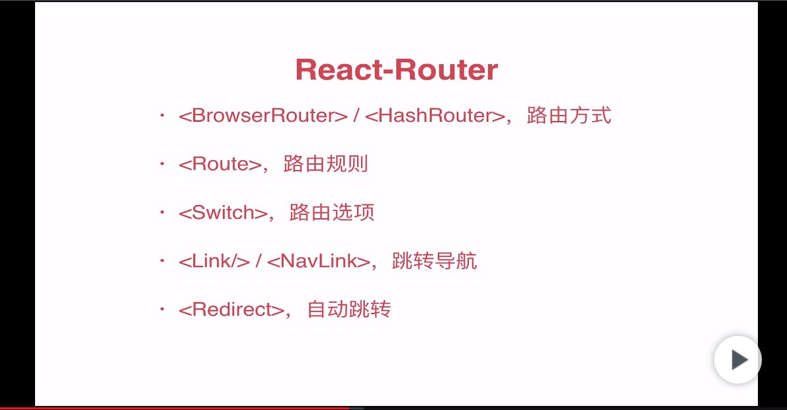

#REACT学习
- 虚拟dom
>实现dom元素高效更新
js创建两个dom树对象(js对象,虚拟dom),对比两个dom树,实现高效更新
- diff算法
>实现高效对比差异的算法
    tree diff :新旧两颗dom树,逐层对比,外层
    component tree: 在tree diff时,每层中组件级别对比,中层
    element diff:component diff进行时,元素级别对比,内层
##非脚手架部分
###安装
```html
<!DOCTYPE html>
<html>
  <head>
    <meta charset="UTF-8" />
    <script src="../build/react.development.js"></script>
    <script src="../build/react-dom.development.js"></script>
    <script src="../build/babel.min.js"></script>
    <!-- 
    react.js 是 React 的核心库，
    react-dom.js 是提供与 DOM 相关的功能，
    babel.js 的作用是将 JSX 语法转为 JavaScript 语法，这一步很消耗时间，实际上线的时候，应该将它放到服务器完成。
 -->
  </head>
  <body>
    <div id="root"></div>
    <script type="text/babel">
    //<script> 标签的 type 属性为 text/babel 。这是因为 React 独有的 JSX 语法，跟 JavaScript 不兼容。凡是使用 JSX 的地方，都要加上 type="text/babel"
      ReactDOM.render(
        <h1>Hello, world!</h1>,
        document.getElementById('root')
      );
    </script>
  </body>
</html>
```
###ReactDOM.render()
```javascript
ReactDOM.render 是 React 的最基本方法，用于将模板转为 HTML 语言，并插入指定的 DOM 节点。
```
###jsx语法
```javascript
// js,html混写
// {插值}
// 标签必须闭合
// 属性改写 class ==> className  label的for ==> htmlFor
var arr = [<div key="1">123</div>,<div key="2">456</div>]
var data = ['a','b','c']
ReactDOM.render(
    <div>
        {arr}   {/*注释:直接引入变量,如果是数组,能展开其中的项*/}
        data.map((item,index)=>{    {/*遍历返回结构,要加key值,便于react判断更新*/}
            return <span key={index}>{item}</span>
        })
    </div>
    document.getElementById('root')
)
```
###组件
- 组件名必须大写开头
- 只能包含一个顶层标签
- 类继承方式
```javascript
class Welcome extends React.Component{
    render(){
        return(
            <div>基础组件</div>
        )
    }
}
ReactDOM.render(
    <Welcome/>,
    document.getElementById('root)
)
```
###props,state
- props 组件属性 组件传递的数据绑定在此  只读
    - propTypes 定义数据类型和是否必须引入
    - defaultProps  定义默认值
    - 命名属性时有些字段不能用,class 属性需要写成 className ，for 属性需要写成 htmlFor ，这是因为 class 和 for 是 JavaScript 的保留字。
    - props.children是props的固定字段,表示组件的所有子节点
- state 组件内定义的数据    可读写,引起视图更新
    - setState({},callback)  异步,更新state数据,引起视图更新(直接this.state[key]='',不会引起视图更新)
```javascript
<script src="../build/prop-types.js"></script>
// propTypes,defaultProps需要prop-types.js
class Welcome extends React.Component{
    constructor(props){
        super(props)
        this.state = {
            flag:true
        }
    }
    static propsTypes = {
        title:PropTypes.string.isRequired
    }
    static defaultProps = {
        content:'默认内容'
    }
    handleClick(){
        this.setState({flag:false})
    }
    render(){
        return(
            <div>
                <h1>{this.props.title}</h1>
                <article>{this.props.content}</article>
                {
                    this.state.flag?(<button onClick={this.handleClick.bind(this)}>确定</button>):this.props.children
                }
            </div>
        )
    }
}
ReactDOM.render(
    <Welcome title="标题">
        <button>编辑</button>
        <button>删除</button>
    </Welcome>,
    document.getElementById('root')
)
```

###真实DOM
- 定义ref属性
    - ref="inputdom"    在元素上直接设置
    - this.refBtn = React.createRef() constructor中定义属性
- 获取DOM(对应上边两种定义方式)
    - this.refs.inputdom
    - this.refBtn.current
```javascript
class Welcome extends React.Component{
    constructor(props){
        super(props)
        this.state = {
            value:''
        }
        this.refBtn = React.createRef()
        this.handleClick = this.handleClick.bind(this)
    }
    handleClick(){
        this.refs.inputdom.focus()
        this.refBtn.current.style.cssText="color:red"
    }
    render(){
        return(
            <div>
                <input type="text" value={this.state.value} ref="inputdom"/>
                <input type="button" ref={this.refBtn} value="点击" onClick={this.handleClick}/>
            </div>
        )
    }
}
```
###事件
>驼峰命名onClick,onMouseMove
>input 设置value值不设置onChange将是个只读的
```javascript
class MyComponent extends React.Component{
    constructor(props){
        super(props)
        this.state = {
            value:''
        }
        this.refBtn = React.createRef()
        this.handleChange = this.handleChange.bind(this)    //绑定this指向,也可在标签中绑定,如下
    }
    static defaultProps = {
        placeholder:'阿斯达克'
    }
    handleClick(){
        this.refs.input.focus()
        this.refBtn.current.style.cssText = 'color:#f02'
    }
    handleChange(e){
        this.setState({value:e.target.value})
    }
    render(){
        return(
            <div>
                <input type="text" ref="input" onChange={this.handleChange} placeholder={this.props.placeholder}/>    
                <p>{this.state.value}</p>
                <input type="button" ref={this.refBtn} value="点击" onClick={this.handleClick.bind(this)}/>    
            </div>
        )
    }
}

ReactDOM.render(
<MyComponent placeholder='黑暗时代' />,
document.getElementById('example')
);
```

###生命周期
---
- 共三个状态,每个状态有两个处理函数,will和did
- Mounting  已经插入真是DOM
    - componentWillMount()
    - componentDidMount()
- Updating  正在被重新渲染
    - componentWillUpdate
    - componentDidUpdate
- Unmounting 已经移除真实DOM
    - componentWillUnmount()
        - 离开当前页面时,销毁当前页面时触发
- 还有两种特殊状态的处理函数
    - componentWillReceiveProps(object nextProps)：已加载组件收到新的参数时调用
        - nextProps:更新后的props
    - shouldComponentUpdate(object nextProps, object nextState)：组件判断是否重新渲染时调用
        - 参数为更新后的props和state;是整个props或state
        - 是否触发更新,需要return true才会触发更新的函数;
---
- 整个执行顺序: constructor-->componentWill*-->render-->componentDid*-->componentWillUnmount
```javascript
class Hello extends React.Component{
    constructor(){
        super()
        this.state = {
            opacity:1
        }
        this.stl = React.createRef()
    }
    componentDidMount(){
        setInterval(() => {
            var opacity = this.state.opacity
            opacity-=0.1
            if (this.state.opacity <0) {
                opacity =1
            }
            this.setState({opacity:opacity})
        }, 100);
    }
    shouldComponentUpdate(nextProps,nextState){
        // nextProps,nextState是更新后的props和state
        return true     //return false 的话不会触发更新
    }
    render(){
        return(
            <div ref={this.stl} style={{'opacity':this.state.opacity}}>
                hello{this.props.name} {this.state.opacity}
            </div>
        )
    }
}

ReactDOM.render(
<Hello name="world"/>,
document.getElementById('example')
);
```

###表单,ajax
---
```javascript
<script src="../build/jquery.min.js"></script>
class UserGist extends React.Component{
    constructor(){
        super()
        this.state = {
            nick:'',
            perms:[]
        }
    }
    componentDidMount(){
        $.get(this.props.source,(res)=>{
            console.log(res)
            this.setState({
                nick:res.data.nick,
                perms:res.data.perms
            })
        })
    }
    render(){
        return(
            <div>
                <h2>{this.state.nick}</h2>
                <ul>
                    {
                        this.state.perms.map((item)=>{
                            return <li>{item.name}{item.val}</li>
                        })
                    }    
                </ul>
            </div>
        )
    }
}
ReactDOM.render(
<UserGist source="https://www.easy-mock.com/mock/5cd0f626e1fe52746e062a2b/jzy-btn/jzy-btn-get" />,
document.getElementById('example')
);

// 还能接受promise
class RepoList extends React.Component{
    constructor(){
        super()
        this.state = {
            loading:true,
            error:null,
            value:null
        }
    }
    componentDidMount(){
        this.props.promise.then(res=>{
            console.log(res)
            if(res.data.succ){
                this.setState({
                    loading:false
                })
            }
        })
    }
    render(){
        if(this.state.loading){
            return <span>loading</span>
        }else if(this.state.error){
            return <span>error</span>
        }else{
            return <span>value</span>
        }
    }
}

ReactDOM.render(
<RepoList promise={$.getJSON('https://www.easy-mock.com/mock/5cd0f626e1fe52746e062a2b/jzy-btn/jzy-btn-get')} />,
document.getElementById('example')
);
```

##自建webpack部分
---

###安装、配置
---
- [安装配置webpack]('/webpack.md')
- 安装react
```javascript
cnpm i react react-dom -S

import React from 'react'
import ReactDOM from 'react-dom'
```

###项目结构
---
|---src
|------asset
|---------css
|------------*.less
|------components
|---------*.jsx
|------index.html
|------index.js
|---package.json
|---webpack.config.js

###index.js
---
```js
import React from 'react'   //创建组件,虚拟dom,生命周期
import ReactDOM from 'react-dom'    //把创建好的组件或虚拟dom渲染到页面

import * as dom from './React.createElement'    //通过React.createElement()创建元素
import * as components from './components/function' //构造函数形式创建组件
import * as jsx from './components/React.Component' //class继承方式创建组件

// ReactDOM.render(dom.mydiv,document.getElementById('app'))
const Hello = components.Hello
const HelloJsx = jsx.HelloJsx
const ClassComponent = jsx.ClassComponent
const ListBox = jsx.ListBox
const propsInfo = {
    name:'gss',
    age:18,
    gender:'man'
}
const lists = [
    {name:'gss',content:'咯技术的',time:new Date().toLocaleDateString()},
    {name:'vic',content:'王斐然',time:new Date().toLocaleDateString()},
    {name:'hhj',content:'复合肥',time:new Date().toLocaleDateString()},
]
// ReactDOM.render(<Hello {...propsInfo}><p>元素子节点</p><p>元素子节点</p></Hello>,document.getElementById('app'))
// ReactDOM.render(<HelloJsx {...propsInfo}><p>元素子节点</p><p>元素子节点</p></HelloJsx>,document.getElementById('app'))
// ReactDOM.render(<ClassComponent {...propsInfo}><p>元素子节点</p><p>元素子节点</p></ClassComponent>,document.getElementById('app'))
ReactDOM.render(<ListBox lists={lists}></ListBox>,document.getElementById('app'))
```

###jsx语法
---
>语法支持需要配置webpack,babel
>js写法
```js
{data,fn}  //插值
{/*备注*/}  //备注
<div dangerouslySetInnerHTML={{__html:data}}></div>     //渲染html;data即'<span>html形式数据</span>'
```

###事件
---
>onClick,onMouseMove...驼峰命名

###组件
---
>首字母必须大写,构造函数,和class两种形式构建
>需要引入React模块
- 有状态组件:class形式
    - 有私有数据state,生命周期
    ```js
    //list.jsx
    import React from "react";
    import listCss from '../css/list'
    import 'bootstrap/dist/css/bootstrap'

    class List extends React.Component{
        constructor(props){
            super(props)    //props只读
            this.state = {  //state,可读可写
                lists:this.props.lists,
                msg:'aaa'
            }
        }
        handleClick(i){
            console.log(this.state.msg,'1')
            this.setState({msg:'bbb'},function(){   //异步
                console.log(this.state.msg,'2') //回调
            })
            console.log(this.state.msg,'3')
            this.state.lists.splice(i,1)
        }
        render(){
            return(
                <ul className='box'>
                    {this.state.lists.map((item,index)=>{
                        return (<li key={index} style={{background:'#f02'}}>
                            <p className={listCss.name}><span>评论人</span>{item.name}</p>
                            <p className={listCss.content}><span>留言:</span>{item.content}</p>
                            <p className={listCss.time}><span>时间:</span>{item.time}</p>
                            <button className='btn btn-primary' onClick={this.handleClick.bind(this,index)}>删除</button>
                        </li>)
                    })}
                </ul>
            )
            
        }
    }
    export default List
    ```
- 无状态组件:fn构造函数形式
    - 无私有数据,生命周期,单纯的静态组件可以用
    ```js
    function HelloJsx (props){
        return <div>组件--构造函数形式生成<div>{props.name}--{props.age}--{props.children.map((item,index)=> <div key={index}>{item}</div>)}</div></div>
    }
    ```

###高阶组件
>定义一个方法,接受一个组件作为参数,进行相关操作后再返回这个组件
```js
// superComponent.js    高阶组件
import React from 'react'
export default function(Wapper){    //注意:Wapper要大写,满足组件命名
    return class extends React.Component{   //返回一个组件
        render(){
            const time = new Date().toLocaleDateString()
            return(
                <Wapper time={time}></Wapper>   //为组件添加了time属性,并返回
            )
        }
    }
}
// someComponent.js     配引用的组件
class SomeComponent extends React.Component{
    render(){
        return(
            <div>
                <time>{this.props.time}</time>
                <p>此组件为高阶组件作为参数处理的组件,具有了time属性</p>
            </div>
        )
    }
}
export default SuperComponent(SomeComponent)
```

###函数作为子组件
>this.props.children()是一个函数,在组件中可以把一些值传递出来,控制组件的内容
```js
class FnComponent extends React.Component{
    render(){
        return(
            <div>
                <p>组件内部</p>
                {this.props.children('函数的参数')}
            </div>
        )
    }
}
<FnComponent>
    {
        val=>(<div>从内部传出来的数据:{val}</div>)  //(函数的参数)
    }
</FnComponent>
```

###context api  上下文
>解决组件通信,通过React.createContext(data)创建
>.Provider父容器,绑定值并监听变化
>.Consumer子容器,能接受到父容器的值
```js
const cn_ = {
    commit:'提交',
    cancel:'关闭'
}
const en_ = {
    commit:'commit',
    cancel:'cancel'
}
const localContext = React.createContext(cn_)   //创建上下文,默认数据是cn_

class LocalProvider extends React.Component{
    state={locale:cn_}
    toggleLocal = () =>{
        const locale = this.state.locale === cn_?en_:cn_
        this.setState({locale})
    }
    render(){
        return(
            <localContext.Provider value={this.state.locale}>
                <button onClick={this.toggleLocal}>切换中英文</button>
                <localContext.Consumer>
                    {
                        val=>(  //接受到的父容器的数据
                            <div>
                                <button>{val.commit}</button>
                                <button>{val.cancel}</button>
                            </div>
                        )
                    }
                </localContext.Consumer>
                
                {this.props.children}   //也可拆分组件
            </localContext.Provider>
        )
    }
}

class LocalButton extends React.Component{
    render(){
        return(
            <localContext.Consumer>
                {
                    val=>(  //接受到的父容器的数据
                        <div>
                            <button>{val.commit}</button>
                            <button>{val.cancel}</button>
                        </div>
                    )
                }
            </localContext.Consumer>
        )
    }
}

<LocalProvider>
    <LocalButton></LocalButton>
</LocalProvider>
<LocalButton></LocalButton>     //注意:放到provider外也能用,默认值是创建context时的初始值,切不会随父容器的值改变而改变

```

###defaultProps,propTypes
---
```js
// 设置组件默认props数据和数据类型
// 规定数据类型需要引入propTypes
import propTypes from 'prop-types'
class demo extends React.Component{
    constructor(){}
    static defaultProps = {     //通过类的静态属性声明
        title:'默认标题'
    }
    static propTypes = {
        num:PropTypes.number.isRequired     //num的类型时数字,必须传入
    }
}
```

###style
---
- 行内样式 {{}}
    ```jsx
    <li key={index} style={{background:'#f02'}}></li>
    ```
    - 分离成js
    ```jsx
    const objcss = {
        list:{color:'#f02',fontSize:'24px'}
    }
    <li style={objcss.list}></li>
    ```
- 样式表(配置webpack,cssloader,lessloader)
    - 导入
    ```js
    import listCss from '../css/list'       //设置css模块化(scoped)是能导出class,id对象
    //list.less中
    /*
    .time{
        color:'#f02';
        ...
    }
    */
    import 'bootstrap/dist/css/bootstrap'   //第三方库,不设置模块化,直接引入即可,因为不模块化时,导入对象为空
    <p className={listCss.time}><span>时间:</span>{item.time}</p>   //模块化后.类名或.id名即可;此时真实的className是'src-css-list__content--3Oq4m',详见webpack配置css-loader部分
    <button className='btn btn-primary' onClick={this.handleClick.bind(this,index)}>删除</button>   //没有模块化的能直接使用类名
    ```
    - 模块化,只有class,id生效,标签不能模块化
        - :global(.className){全局生效,不被模块化}
        - :local(.className){局部,开启模块化时默认就是,不用写}
- 第三方样式
    >引入第三方样式时注意模块化配置,由于第三方都是.css,所以我们自己用.less或.sass,配置.less.sass模块化即可,避免了第三方模块化

- sass、less
    - npm i -D less less-loader
    - npm i -D node-sass sass-loader

###[react-router-dom](https://reacttraining.com/react-router/web/example/basic)
---

- 安装,配置
    ```js
    npm i -S react-router-dom
    import {HashRouter as Router,Route,Link} from 'react-router-dom'    //hash模式
    import {BrowserRouter as Router,Route,Link} from 'react-router-dom' //history模式

    ```
- 路由模式(history)
    ```
    HashRouter:hash模式 /#/
    BrowserRouter:history模式   会有路径问题,需服务端配置
    ```

- 动态路由
    ```js
    <Route path={`${path}:name`} />
    <Link to={`${path}/gss`}/>  ===>    localhost:8080/news/gsss
    获取参数:this.props.match.params    ===> {name:'gss'}
    //动态路由匹配a/:id;a/sub;a;即跳转到a路由的三种情况:1带参数,2访问a的子路由,3直接访问a路由
    import React from 'react'
    import {HashRouter as Router,Route,Link,Switch} from 'react-router-dom'

    class A extends React.Component{
        componentDidMount(){
            console.log(this.props)
            //this.props.match.path ==>/a
        }
        render(){
            return(
                <div>
                    <p>Component A</p>
                    <Switch>
                        <Route exact path={`${this.props.match.path}`} render={()=>(<div>动态路由匹配</div>)}/> //path设为跟路由,即此组件的路由/a;注意render的参数是props,返回值是一个组件(如下面嵌套路由部分)
                        <Route exact path={`${this.props.match.path}/sub`} render={(props)=>(<div>动态路由匹配{props.location.pathname}</div>)}/> //path=/a/sub   精准匹配子路由sub
                        <Route exact path={`${this.props.match.path}/:id`} render={(props)=>(<div>动态路由匹配id :{props.match.params.id}</div>)}/>   //path=/a/123   匹配id参数
                    </Switch>
                </div>
            )
        }
    }
    class B extends React.Component{
        render(){
            return(
                <div>Component B</div>
            )
        }
    }

    class App extends React.Component{
        render(){
            return(
                <Router>
                    <div>
                        <Link to='/a/123'>to A id 123</Link>    //跳转a路由的三种方式
                        <br/>
                        <br/>
                        <Link to='/a/sub'>to A /sub</Link>
                        <br/>
                        <br/>
                        <Link to='/a'>to A</Link>
                        <br/>
                        <br/>
                        <Link to='/b'>to B</Link>
                    </div>
                    <Route path='/a' component={A}/>    //注意此处定义Route只写/a,具体匹配在a组件中设置
                    <Route path='/b' component={B}/>
                </Router>
            )
        }
    }

    export default App


    ```
- get传值
    ```jsx
    <Route path={path}} />
    <Link to={`${path}?name=gss`}/>  ===>    localhost:8080/news?name=gsss
    获取参数:this.props.location.search ===>    "?name=vic"
    ```
- 跳转方式
    - a标签
    - link to 
    - this.props.history.push();replace();go();goBack()
        - push('list')
        - push({pathname:'list',state:{id:123}})
    - 传值在props中获取
    ```js
        //router.jsx
        import React from 'react'
        import {HashRouter,Route,Switch,hashHistory} from 'react-router-dom'

        import Home from '../components/route-home'
        import News from '../components/route-news'
        import List from '../components/route-list'

        export default class App extends React.Component{
            render(){
                return(
                    <HashRouter history={hashHistory}>  //hashHistory模式
                        <Switch>    //只能包Route
                            <Route exact path='/' component={Home}></Route>
                            <Route exact path='/news/:id' component={News}></Route> //动态路由
                            <Route exact path='/list' component={List}></Route>
                        </Switch>
                    </HashRouter>
                )
            }
        }
        //home.js
        import React from 'react'
        import {Link} from 'react-router-dom'
        export default class Home extends React.Component{
            componentDidMount(){
                // console.log(this.props.history.push)
            }
            render(){
                return(
                    <div>
                        <h2>route-home</h2>
                        //动态路由跳转
                        <a href="#/news/123">a标签去news</a>{/* 得带# */}   //a标签
                        <br/><br/>
                        <Link to='/news/987'>Link to='/news/987' 去news</Link>  //link to
                        <br/><br/>
                        <Link to={{pathname:'/news/234'}}>Link to= pathname:'/news/234' 去news</Link>
                        <br/><br/>
                        <button onClick={()=>{this.props.history.push({pathname:'news/879',state:{id:5445}})}}>点击去news</button>  //this.props.history.push()
                        <button onClick={()=>{this.props.history.replace({pathname:'news/879'})}}>点击去news</button>  //this.props.history.push()
                        <hr/><br/>
                        //get传值
                        <Link to='/list'>Link to='/list' 去list</Link>
                        <br/><br/>
                        <Link to='/list?id=2837'>Link to='/list?id=2837' 去list</Link>
                        <br/><br/>
                        <button onClick={()=>{this.props.history.push({pathname:'list',state:{id:5445}})}}>点击去list</button>
                        <button onClick={()=>{this.props.history.replace({pathname:'list',state:{id:5445}})}}>点击去list</button>
                    </div>
                )
            }
        }
    ```

- 重定向 <Redirect to="/path" />

- 嵌套路由
    - routes抽离
    ```js
    import Home from '@/components/home'
    import News from '@/components/news'
    import Todo from '@/components/todo'
    import Error from '@/components/error'

    import Shehui from '@/components/newsItem/shehui'
    import Fashion from '@/components/newsItem/fashion'
    const routes = [
        {
            path:'/',
            component:Home,
            exact:true      //精准匹配
        },
        {
            path:'/news',
            component:News,
            routes:[    //子路由,固定字段
                {
                    path:'/news',
                    component:Shehui,
                    exact:true
                },
                {
                    path:'/news/fashion',
                    component:Fashion
                }
            ]
        },
        {
            path:'/todo',
            component:Todo
        }
    ]

    export default routes
    ```
    - 定义父级路由,并传递子路由配置到子路由
    ```js
    //app.js
    import React from 'react'
    import {HashRouter as Router,Route,Link} from 'react-router-dom'
    import { Button } from 'antd';
    import Routes from '@/routes/index'

    export default class App extends React.Component{
        render(){
            return(
                <Router>
                    <div>
                        <header>
                            <Button type="primary"><Link to="/">首页</Link></Button>
                            <Button type="primary"><Link to="/news">新闻</Link></Button>
                            <Button type="primary"><Link to="/todo">列表</Link></Button>
                        </header>
                        <hr/>
                        {
                            Routes.map((item,index)=>{
                                if(item.exact){
                                    return <Route key={index} exact path={item.path}
                                    render={props=>(<item.component {...props} routes={item.routes}></item.component>)} />
                                }else{
                                    return <Route key={index} path={item.path}
                                    render={props=>(<item.component {...props} routes={item.routes}></item.component>)}/>
                                }
                            })
                        }
                    </div>
                </Router>
            )
        }
    }
    //news.js
    import React from 'react'
    import {Route,Link} from 'react-router-dom'
    import { Button } from 'antd';
    const stl = {
        left:{float:'left',width:'20%'},
        right:{float:'right',textAlign:'center',width:'80%'}
    }

    export default class News extends React.Component{
        componentDidMount(){
            console.log(this.props)     //路由信息在this.props.routes中获取
        }
        render(){
            return(
                <div>
                    <div className="left" style={stl.left}>
                        <Button type="primary"><Link to='/news'>社会新闻</Link></Button>
                        <br/>
                        <Button type="primary"><Link to='/news/fashion?name=vic'>时尚新闻</Link></Button>
                    </div>
                    <div className="right" style={stl.right}>
                        {
                            this.props.routes.map((item,index)=>{
                                if(item.exact){
                                    return <Route key={index} exact path={`${item.path}`} component={item.component}/>
                                }else{
                                    return <Route key={index} path={`${item.path}`} component={item.component}/>
                                }
                                
                                
                            })
                        }
                    </div>
                </div>
            )
        }
    }
    ```
- 页面刷新404问题
    - 改为HashRouter模式

###redux
>npm i -S redux     不是react专用,可单独使用
>单项数据流
- import {createStore,combineReducers,bindActionCreators} from 'redux
- createStore | 创建store,参数为reducer
    - const store = createStore(reducer)
- combineReducers | 合并多个reducer
    - const rootReducer = combineReducers(allReducers)
- bindActionCreators | 简化dispatch触发
    ```js
    function plusOneFn () {     //一个action
        return {
            type:PLUS_ONE
        }
    }
    const plusOne = bindActionCreators(plusOneFn,store.dispatch)    //处理action
    plusOne()   //调用 相当于 store.dispatch(plusOneFn)
    ```
---
- store | 根据reducer初始化store,初始state值是reducer里传入的默认值
    - getState()
    - dispatch(action)
    - subscribe(listener)
- action | 定义type和传递新的参数触发reducer
    ```js
    export function addList(name,content,no){
        return {
            type:ADD_LIST,     //必要,固定为type,触发reducer是根据type来的
            payload:{name,content,no}
        }
    }
    
    ```
- reducer | 一个函数,根据action.type触发store的变化
    ```js
    export default function (state=[],action){      //两个参数,state即store的值,action用于接受type,判断是否触发
        switch(action.type){
            case ADD_LIST:
                return{             //reducer返回的是新的state,整体替换原来的值
                    ...state,       //保留原来的值
                    payload:[...state.list,action.payload]     //更新原来store里list的值,在list数组中添加一项action.payload
                }
            default:
                return state
        }
    }
    ```
###异步处理中间件

####redux-thunk

####redux-saga

###react-redux
