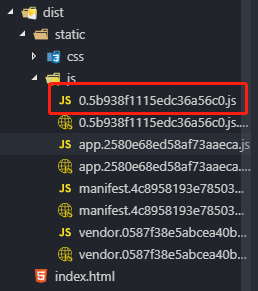

#VUE中常用知识点
##关于router
```javascript
this.$router.push('/login');    //跳转,会向history栈中添加记录,能正常返回
this.$router.go(-1);
this.$router.replace(); //替换当前history记录,即返回时还是本页,再返回才是上页
this.$route     //route对象
//全局路由导航
router.beforeEach((to, from, next) => {
    const role = localStorage.getItem('ms_username');
    if (!role && to.path !== '/login') {
        next('/login');
    } else if (to.meta.permission) {
        // 如果是管理员权限则可进入，这里只是简单的模拟管理员权限而已
        role === 'admin' ? next() : next('/403');
    }
})
// 组件内路由导航
beforeRouteEnter (to, from, next) {
    console.log(to);
    console.log(from);
    next()
    // 在渲染该组件的对应路由被 confirm 前调用
    // 不！能！获取组件实例 `this`
    // 因为当守卫执行前，组件实例还没被创建
},
//路由规则
routes: [
    {
      path:'/',
      redirect:'/index'
    },
    {
      path: '/',
      component: resolve => require(['@/components/common/home'], resolve),
      meta: { title: '首页' },
      children:[
        {
          path:'/index',
          component:resolve => require(['@/components/page/index'],resolve),
          meta:{title:'首页-数据可视化'}
        },
        {
          path:'/404',
          component:resolve => require(['@/components/page/404'],resolve),
          meta:{title:'404'}
        },
      ]
    },
    {
      path: '/login',
      component: resolve => require(['@/components/page/login'], resolve)
    },
    {
      path:'*',
      redirect:'/404'
    }
  ]
```
##axios
>拦截器和跨域代理配置

- 跨域代理配置
```javascript
/* 1.跨域代理 */
  // config/dev.envjs
  module.exports = merge(prodEnv, {
    NODE_ENV: '"development"',
    BASE_HOST:'"api"'               //配置开发环境baseurl
  })
  //config/pro.env.js
  module.exports = {
    NODE_ENV: '"production"',
    BASE_HOST:'""'                  //也可以直接写成生产环境地址
    //生产环境baseurl
    // 主意要单引号+双引号形式
    // 设置为空则会自动获取当前页面地址,如http://test-mall.900sup.com/adminrsou/jsp/index.jsp#/proList
    // 获取的是http://test-mall.900sup.com/adminrsou/jsp,
    // 但我们需要是http://test-mall.900sup.com,
    // 所以先设置为空,在封装axios时根据BASE_HOST是否为空判断改变BASE_HOST的值
  }
  // config/index.js
  dev:{
    ...
    proxyTable: {
      '/api':{                      //api即开发环境的baseurl
        target:'http://127.0.0.1:8080/',  //代理到此地址
        changeOrigin:true,          //跨域配置
        pathRewrite:{
          '^/api':''                
          //重写url,把以api开头的重写为空,
          //即代理后的隐式地址为http://127.0.0.1:8080/index.shtml;
          //而不是http://127.0.0.1:8080/api/index.shtml
        }
      }
    },
  }

/* axios封装,拦截器 */
  // 新建fetch.js
  import axios from "axios"
  import router from "../router"
  import util from '../assets//js/util'
  // util.hostPath即动态获取hostpath 如:http://test-mall.900sup.com
  // 创建axios实例
  const service = axios.create({
      baseURL:process.env.BASE_HOST||util.hostPath,      //设置baseURl
      // process.env.BASE_HOST根据之前配置,开发环境是api,生产环境是""
      timeout:5000                        //超时时间
  })


  service.interceptors.request.use(       //请求拦截器
      request=>{
          // request.headers={'X-Custom-Header': 'foobar'}       //设置headers
          // console.log(request);
          return request
      },
      error=>{
          return Promise.reject(error)
      }
  )


  service.interceptors.response.use(
      response =>{
          if(response.headers.jsession_status===101){
              // 登录状态判断
              router.push({path:'/login'})
              return
          }
          // if(response.status!==200){

          // }
          // console.log(response);
          return response
      },
      error =>{
          return Promise.reject(error)
      }
  )

  export default service      //暴露实例
  
  // getData.js  封装get,post请求
  import router from '../router/index'
  import fetch from './fetch'

  const getFetch =(url,data)=>{
      return new Promise((resolve,reject)=>{
          fetch.get(url,{params:data}).then(res=>{
              resolve(res)
          }).catch(error=>{
              reject(error)
          })
      })
  }
  const postFetch =(url,data)=>{
      return new Promise((resolve,reject)=>{
          fetch.post(url,data).then(res=>{
              resolve(res)
          }).catch(error=>{
              reject(error)
          })
      })
  }
```
##关于loading页
>直接再index.html文件中写加载动画,渲染完成会自动删除
```html
<div id="app">
  <div id="loader-wrapper">
    <div id="loader"></div>
    <div class="loader-section section-left"></div>
    <div class="loader-section section-right"></div>
    <div class="load_title">正在加载,请耐心等待
      <br>
      <span>V1.3</span>
    </div>
  </div>
</div>
```
##vue-cli3.0 
>[文档](https://cli.vuejs.org/zh/config/#pages)
```javascript
起步

npm i -g @vue/cli   安装
vue create my-project   创建项目
或者
vue ui  创建项目，项目管理（在已有项目中运行进入项目管理）
npm run serve 启动

如果还想用2.0需安装桥接工具
npm i -g @vue/cli-init  全局安装
vue init webpack my-project 2.0创建项目

通过vue ui创建的项目能够统一管理
通过vue create my-project创建项目能自定义调试，预处理器，typescript等
没了build和config等目录，若需要其他配置则需要自己手动配置


```


##在循环中将数据加到某属性中
```html
<tr v-for="item in Strategys" class="ng-scope">
    <td>
    　　<a class="ng-binding ng-scope" v-bind:href="['xxx/detail/'+item.Id]" >{{item.Name}}</a>
    </td>
</tr>
```
##created、mounted、(activated、deactivated、keep-alive)
>activated和deactivated只有再keepAlive下才生效
>在keepAlive下，由于缓存机制，created和mounted都只在初次进入页面时调用，反复进入会走缓存，所以在created、mounted中的方法不会被调用触发。但activaed会每次进入页面调起，deactivated会在每次离开页面时调起。
```html
<!-- 控制页面是否需要缓存可以通过keep-alive内置属性include、exclude实现 -->
<!-- include包含在内的组件会被缓存，
    exclude包含在内的组件不会被缓存
    注意：每个组件都要设置name属性
 -->
<keep-alive include="home">
    <router-view></router-view>
</keep-alive>
<!-- 控制页面是否需要缓存可以通过路由配置实现 -->
<!-- app.vue 中 -->
<keep-alive>
    <router-view v-if="$route.meta.keepAlive"/>
</keep-alive>
<router-view v-if="!$route.meta.keepAlive"/>
```
```javascript
/*router.js中*/
export default new Router({
    routes:[
        {
            path:'/',
            name:'home',
            component:Home,
            meta:{
                keepAlive:true
            }
        }
        {
            path:'/about',
            name:'about',
            component:About,
            meta:{
                keepAlive:false
            }
        }
    ]
})
```
##computed和watch区别
>computed:计算属性，一般通过其他变量计算得来一个属性、值。具有缓存属性，更节省性能，参与计算的变量不变就会走缓存，不会重复执行
>watch:监听器，一般用于监听某值的变化，实现业务；监听数据来源包括data，props，computed
```html
<div id="app">
    <input v-model="firstName">
    <input v-model="lastName">
    <input v-model="fullName">
    <input v-model="test2">
</div>
```
```javascript

new Vue({
    el:"#app",
    data:{
        firstName:'',
        lastName:'',
        fullName:'',
        test:'读取和设置'
    },
    //watch方式实现fullName
    watch:{
        firstName:function(n){
            this.fullName=n+this.lastName;
        },
        lastName:function(n){
            this.fullName = n+this.firstName;
        },
        $route(n,o){
            //监听路由变化
        }
    }
    //computed方式实现
    conputed:{
        fullName:function(){
            return this.firstName+this.lastName;
        },
        test2:{
          get(){
            return this.test;  //读取初始值
          },
          set(v){
            console,log(v); //读取和设置
            // test2改变时走这里
          }
        }
    }
})


```
##bus(eventBus)组件间数据传递
>父子组件、跨组件信息传递
1.创建bus.js
```javascript
//bus.js
import Vue from 'vue'
const bus = new Vue()
export default bus
```
>2.在需要数据传递的组件中引入bus
```javascript
import bus from '../../assets/js/bus.js'
```
>3.bus.$emit('eventname',data) 通过自定义事件广播数据
>4.bus.$on('eventname',data=>{}) 监听数据，并在回调中处理
##$nextTick
>需要dom结构更新后进行的操作，在nextTick回调中实现
>在数据变化后要执行的某个操作，而这个操作需要使用随数据改变而改变的DOM结构的时候，这个操作都应该放进Vue.nextTick()的回调函数中。

```html
<!-- 示例 -->
<div class="app">
  <div ref="msgDiv">{{msg}}</div>
  <div v-if="msg1">Message got outside $nextTick: {{msg1}}</div>
  <div v-if="msg2">Message got inside $nextTick: {{msg2}}</div>
  <div v-if="msg3">Message got outside $nextTick: {{msg3}}</div>
  <button @click="changeMsg">
    Change the Message
  </button>
</div>
```
```javascript
//示例
new Vue({
  el: '.app',
  data: {
    msg: 'Hello Vue.',
    msg1: '',
    msg2: '',
    msg3: ''
  },
  methods: {
    changeMsg() {
      this.msg = "Hello world."
      this.msg1 = this.$refs.msgDiv.innerHTML
      this.$nextTick(() => {
        this.msg2 = this.$refs.msgDiv.innerHTML
      })
      this.msg3 = this.$refs.msgDiv.innerHTML
    }
  }
})
```

>msg1和msg3显示的内容还是变换之前的，而msg2显示的内容是变换之后的。其根本原因是因为Vue中DOM更新是异步的
##官方文档知识点
```html
<div id="app-2">
  <span v-bind:title="message">
    鼠标悬停显示绑定的提示信息！
  </span>
</div>
```
```javascript
Object.freeze(obj)  阻止修改现有数据,也就是说修改obj也不会再更新
```
---
###生命周期之updated，dom元素更新(渲染)完成，如果要操作DOM，可以在此执行。一般用computed和watch替代
```javascript
updated: function () {
// 由于数据更改导致的虚拟 DOM 重新渲染和打补丁，在这之后会调用该钩子。
  console.log('1：数据更新，dom渲染，顺序1')
  this.$nextTick(function () {
    // Code that will run only after the
    // entire view has been re-rendered
    console.log('3：数据更新，dom渲染，整个视图都重绘完毕，顺序3')
  })
  console.log('2：数据更新，dom渲染，顺序2')
}
```
---
###模板语法
```javascript
/*html结构渲染 */
<p>渲染html结构，rawHtml为html字符串：</p>xuan<span v-html="rawHtml"></span></p>

/*- 绑定class---对象形式 */
<div class="demo" :class="{active:isactive,'text-color':iscolor}"></div>

js
data:{
    isactive:true,
    iscolor:false
}
<div class="demo" :class="classObj"></div>
js
data:{
    classObj:{
        active:true,
        'text-color':false
    }
}
/*结合computed使用，实现动态改变class*/
data: {
  isActive: true,
  error: null
},
computed:{
    classObj:function(){
        return{
            active: this.isActive && !this.error,
            'text-danger': this.error && this.error.type === 'fatal'
        }
    }
}
/*- 绑定class---数组 +对象形式 */
<div class="[a,b]"></div>
<div class="[{good:isGood},b]"></div>
data:{
    a:'active',
    b:'error'
}
```

###key属性的应用
```javascript
//key确定的了唯一性，不加key属性，两个模板中的input实际上是公用一个元素，
//即在一个input中输入了内容，另一个也有了相同内容，
//加上key后就保证了input的唯一性，即两个模板中的input是独立的两个
<template v-if="loginType === 'username'">
  <label>Username</label>
  <input placeholder="Enter your username" key="username-input">
</template>
<template v-else>
  <label>Email</label>
  <input placeholder="Enter your email address" key="email-input">
</template>
```

###事件修饰符|按键修饰符|系统修饰符
```javascript
.stop
.prevent
.captrue
.self
.once
.passive

//表单修饰符    
    v-model.lazy 表示change时才更新值。不是input时
    .number 数值类型
    .trim   自动去空格

.exact
// 即使 Alt 或 Shift 被一同按下时也会触发
<button @click.ctrl="onClick">A</button>

// 有且只有 Ctrl 被按下的时候才触发
<button @click.ctrl.exact="onCtrlClick">A</button>

// 没有任何系统修饰符被按下的时候才触发
<button @click.exact="onClick">A</button>

//.sync修饰符
//父组件向子组件传值时用.sync，子组件改变此值时，父组件中也会相应改变，而不用自定义事件的形式传值给父组件
//自动更新父组件属性的 v-on 监听器。 父子组件之间实现数据双向绑定

示例：
<template>
    <div class="details">
        <myComponent :show.sync='valueChild'></myComponent>
        <button @click="changeValue">toggle</button>
    </div>
</template>
<script>
import Vue from 'vue'
Vue.component('myComponent', {
      template: `<div v-if="show">
                    <p>默认初始值是{{show}}，所以是显示的</p>
                    <button @click.stop="closeDiv">关闭</button>
                 </div>`,
      props:['show'],
      methods: {
        closeDiv() {
          this.$emit('update:show', false); //update:** 直接更新数据并将新数据同步到父组件
        }
      }
})
export default{
    data(){
        return{
            valueChild:true,
        }
    },
    methods:{
        changeValue(){
            this.valueChild = !this.valueChild
        }
    }
}
</script>

```
[.sync详解](https://www.jianshu.com/p/d42c508ea9de)
[更多修饰符](https://cn.vuejs.org/v2/guide/events.html#%E4%BA%8B%E4%BB%B6%E4%BF%AE%E9%A5%B0%E7%AC%A6)


###组件
####父子组件传值
```javascript
    <div>
        子组件child
        <span @click="$emit('passWord',data)"></span>
        <span @click="postData"></span>
    </div>

    props:['msg'],
    methods:{
        postData(){
            this.$emit('passWord2',data)
        }
    }

    <div>
        父组件
        <child @passWord="getChild" :msg="data"></child>
        <child @passWord2="getChild2"></child>
    </div>
    methods:{
        getChild(data){
            data是子组件传来的数据
        }
        getChild2(data){
            data是子组件传来的数据
        }
    }
```
####动态组件，常用切换效果 用 Vue 的 <component> 元素加一个特殊的 is 特性来实现
[动态组件例子](https://jsfiddle.net/chrisvfritz/o3nycadu/)
```javascript
    import c1 from './components/c1'
    import c2 from './components/c2'
    import c3 from './components/c3'
    <component v-bind:is="组件名称（c1,c2,c3）"></component>
```
####父组件异步传值给子组件
```javascript
    //异步传值给子组件是，子组件在加载时，值还是空，会引起报错。解决异步传值有一下几种方法
    1.v-if  在数据获取成功后在加载子组件
    2.watch 子组件内定义一个data，监听props传来的数据item，this.data = item的新值
    3.bus 组件间数据传递 
        bus.$emit('事件名',data) 触发事件
        bus.$on('事件名',data=>{获取数据回调}) 监听事件
    4.设置props default 确保子组件中用到的数据键、类型都存在
    5.vuex    
```
####异步组件
>解决项目过大，按需加载，懒加载组件
把按需加载的组件单独抽离成单个文件，只有需要时才加载

-   第一种：引用组件时 comp1组件再点击加载按钮后再加载
```html
<!-- app.vue -->
<template>
  <div id="app">
    <comp1 :data="msg" v-if="show"></comp1>
    <button @click="getComp">加载异步组件</button>
    <router-view/>
  </div>
</template>
```
```javascript
// app.vue
export default {
  name: 'App',
  data(){
    return{
      show:false,
      msg:'父组件传来的数据'
    }
  },
  methods: {
    getComp(){
      this.show = !this.show;
    }
  }
}

/*main.js*/
//异步组件
Vue.component('comp1',(resolve)=>{
    require(['./components/comp1.vue'],resolve)
})
// 高级异步组件
import Loading from './loading.vue'
Vue.component('comp3',()=>({
  component:import('./components/comp3.vue'),   // 需要加载的组件 (应该是一个 `Promise` 对象)
  loading:Loading,  // 异步组件加载时使用的组件
  error:Loading,    // 加载失败时使用的组件
  delay:200,    // 展示加载时组件的延时时间。默认值是 200 (毫秒)
  // 如果提供了超时时间且组件加载也超时了，
  // 则使用加载失败时使用的组件。默认值是：`Infinity`
  timeout:3000
}))
//高级异步组件封装
function lazyLoadView(asyncView) {  //引入组件的工厂函数
  const asyncHandler = ()=>({
    component:asyncView,
    loading:require('../components/loading.vue'),
    error:require('../components/error.vue'),
    delay:200,
    timeout:3000
  })
  return Promise.resolve({  //将普通法对象转为promise对象，返回promise
    functional:true,
    render(h,{data,children}){  //render函数
      return h(asyncHandler,data,children)
    }
  })
}
//注 Promise.resolve('foo')等价于
new Promise(resolve=>resolve('foo'))
```
[render函数](https://blog.csdn.net/qq78827534/article/details/80792514)
```javascript
// router.js
const comp5 = ()=>lazyLoadView(import('../components/comp5.vue'))
// 正常配置路由即可
export default new Router({
  routes: [
    {
      path:'/p5',
      name:'comp5',
      component:comp5
    }
  ]
})
```
```javascript
//设置此异步全局组件后，会单独生成一个js，点击加载组件按钮时，下载此js
```

-   第二种：路由组件 跳转到那个路由才加载对应的组件
```javascript
// 配置router
/*index.js*/
const comp2 = r => require.ensure([],()=>r(require('../components/comp2.vue')),'comp2')
// require.ensure() 是 webpack 特有的实现代码打包分离
Vue.use(Router)

export default new Router({
  routes: [
    {
      path: '/',
      name: 'HelloWorld',
      component: HelloWorld
    },
    {
      path:'/p2',
      name:'comp2',
      component:comp2
    }
  ]
})
// 二
const Foo = () => import(/* webpackChunkName: "group-foo" */ './Foo.vue')
// 此方法需要 syntax-dynamic-import 插件。配置babel，但涉及babel的版本问题，可能会报错
```
-   第三种：未知组件名称，异步请求获取组件名称，渲染动态组件（结合上面动态组件）
```html
<template>
    <component :is="item" v-for="item in compArr"></component>
</template>
```
```javascript
data(){
    return{
        compArr:[]
    }
},
created(){
    this.axios('http://localhost:3000/comp').then(res=>{
        console.log(res.data);  //['comp1','comp2','comp3']
        res.data.forEach(item => {
            this.compArr.push(()=>import(`./components/${item}`));  //根据请求到的组件名称引入组件()=>import(`./components/${item}`)
            // 打包时也会拆分打包
        });
    })
}
```
[vueRouter-api](https://router.vuejs.org/zh/guide/advanced/lazy-loading.html#%E6%8A%8A%E7%BB%84%E4%BB%B6%E6%8C%89%E7%BB%84%E5%88%86%E5%9D%97)
[ syntax-dynamic-import插件及babel配置](https://babeljs.io/docs/en/babel-plugin-syntax-dynamic-import)

---
###插槽
```javascript
    <div>
        父组件
        <child>
            <b @click="test">子组件，插槽直接传递内容</b>   //插槽内能放任何模板代码包括其他组件
            <template slot="other">
                多个插槽时，template元素加slot属性想具名插槽输出内容
            </template>
            <h1 slot="other2">也能用在普通元素中</h1>
        </child>
        
    </div>
    methods:{
        test(){
            可以在插槽中定义事件方法
        }
    }

    <div>
        子组件
        <solt>插槽内的内容会被覆盖</solt>       //solt插槽显示父组件写在子组件的内容‘子组件，插槽直接传递内容’
        <solt name="other"></solt>  //用name属性定义更多插槽
    </div>
```
###作用域插槽，（带数据的插槽，数据由子组件提供，父组件内调用子组件数据）
```javascript
    //父组件
    <div>
        <child>
            <template slot-scope="zdy">   //slot-scope属性接受子组件数据，zdy是自定义的。
                {{zdy.data.title}}      //data即子组件slot上绑定的数据
            </template>
            <template slot-scope="{data}">   //可以用解构的方法，更简洁
                {{data.title}}      //data即子组件slot上绑定的数据
            </template>
        </child>
    </div>

    子组件
    <div>
        <slot :data="formData"></slot>
    </div>
    data(){
        return{
            formData:{title:'子组件数据'}
        }
    }
```
---
##transition
```html
<!-- enter-active-class="animated tada" 配合第三方插件设置进入等状态动画-->
<!-- name属性对应class 没设置name时 默认class是 v-开头（v-enter、v-enter-active、v-enter-to、v-leave、v-leave-active、v-leave-to） -->
<!-- 设置了name时 name的值替代v-，.fade-enter-active, .fade-leave-active -->
<!-- model 过度模式 out-in 当前元素先离开，新元素再进来-->
<transition name="fade" mode="out-in"
  enter-active-class="animated tada"    
  leave-active-class="animated bounceOutRight">
      
    <div v-if="show" key="t1">测试</div>  <!-- 包含多个组件时需要key -->
    <div v-if="!show" key="t2">测试2</div>
</transition>
<transition enter-active-class="animated tada"
    leave-active-class="animated bounceOutRight">
  <router-view/>
</transition>

<!-- 列表过度 -->
<!-- tag属性表示把transition-group标签解析成什么标签 -->
<!-- 必须有key标识，确保唯一 -->
<transition-group name="list" tag="span">
  <span v-for="(item,index) in list" :key="index" class="list-item">{{item}}</span>
</transition-group>
<!-- 给列表元素设置transition属性 -->
.list-item {    
  transition: all 1s;
  display: inline-block;
  margin-right: 10px;
}
```
```javascript
/*第三方库*/
@import'https://cdn.jsdelivr.net/npm/animate.css@3.5.1';
```
##provide,inject
>父组件中通过provide来提供变量，然后在子组件中通过inject来注入变量。
不论子组件有多深，只要调用了inject那么就可以注入provider中的数据。而不是局限于只能从当前父组件的prop属性来获取数据。
>可用于信息传递和组件刷新等事件操作
```javascript
// 组件刷新通过app.vue中<router-view v-if="isRouterAlive"></router-view>的 v-if="isRouterAlive"控制重新渲染实现刷新
// app.vue
<router-view v-if="isRouterAlive"></router-view>
provide(){
  return{
    reload:this.reload,     //传递的变量名是reload,值是reload方法
    msg:"单纯传值",
  }
},
data(){
  return{
    isRouterAlive:true,
  }
},
methods:{
  reload(){     //通过v-if重新渲染,刷新组件页面
    this.isRouterAlive=false;
    this.$nextTick(()=>{
      this.isRouterAlive=true;  
    })
  }
}

// 子组件中(控制路由的菜单中)
// slider.vue
inject:["reload","msg"],      //inject接受变量reload
data(){
  return{
    word:this.msg,            //接受msg的值"单纯传值"
  }
},
methods:{
  handlerReload(){      //组件中的刷新操作
    this.reload()       //调用reload实现组件刷新
  }
}


```
##自定义指令
```javascript
// 全局组件
Vue.directive('name',{
  bind:function(el,binding){
    el.innerText="name:"+binding.value;
  }
})

// 局部组件指令
// 组件中接受一个directives选项
methds:{},
directives:{
  h:{
    inserted:(el,binding)=>{
      console.log(el.innerText='组件自定义指令');
    }
  }
}
```
```html
<div v-name="gss">
<!-- name：gss -->
</div>    
<div v-h>
<!-- 组件自定义指令 -->
</div>    
```
```javascript
// 自定义指令的钩子函数(都是可选参数，可多选)
bind:只调用一次，指令第一次绑定到元素时调用。此时html结构可能还没渲染完成
inserted:被绑定元素插入父节点时。此时能进行dom操作
update:所在组件的 VNode（钩子函数的参数） 更新时调用，但是可能发生在其子 VNode 更新之前。指令的值可能发生了改变，也可能没有。但是你可以通过比较更新前后的值（通过binding参数里的vnode和oldVnode判断）来忽略不必要的模板更新
componentUpdated:指令所在组件的 VNode 及其子 VNode 全部更新后调用
unbind:只调用一次，指令与元素解绑时调用

// 钩子函数的参数（el、binding、vnode、oldVnode）
el:应用指令的当前元素

binding:指令的相关参数都在binding对象中
binding.name:指令名称（如上：name、h）
binding.value:指令接受的值（如上：gss[string
，number，array，object]）
oldValue：指令绑定的前一个值，仅在 update 和 componentUpdated 钩子中可用。无论值是否改变都可用
binding.expression:字符串形式的指令表达式。例如 v-my-directive="1 + 1" 中，表达式为 "1 + 1"
binding.arg：传给指令的参数，可选。例如 v-my-directive:foo 中，参数为 "foo"
binding.modifiers：一个包含修饰符的对象。例如：v-my-directive.foo.bar 中，修饰符对象为 { foo: true, bar: true }

vnode：Vue 编译生成的虚拟节点
oldVnode：上一个虚拟节点，仅在 update 和 componentUpdated 钩子中可用
```
##VUEX
>拆分模块的形式
npm i -S vuex
创建store.js
```javascript
import Vue from 'vue'
import Vuex from 'vuex'
import user from './user'
import getters from './getters'   //注意名称必须时getters
Vue.use(Vuex)   //注意必须得.use
const store = {
  modules:{
    user,
  },
  getters     //把需要访问的状态(变量)统一挂在getters上,在组件中通过mapGetters获取,注意名称必须时getters
}
export default store
```
>创建user.js和getters.js
```JavaScript
// user.js
const user = {
  state:{
    name:'victor',
    age:18
  },
  mutations:{
    SET_NAME(state,data){
      state.name=data
    }
  },
  actions:{
    updateName({commit,state},data){
      let age = state.age   //能通过state直接获取其中的值
      commit('SET_NAME',data)   //触发更改方法
      // 可以返回
    }
  }
}
export default user

//getters.js
const getters={
  name:state=>state.user.name,  //根据模块名(user)调用赋值
}
export default getters
```
>在main.js中引用store,并在new Vue中配置
```javascript
import store from './store'
new Vue({
  store
})
```
>在模板中的使用
```javascript
// *.vue 
import {mapGetters} from 'vuex'  //先引入辅助函数

computed:{
  ...mapGetters(['name']),  //即可调用user内的name直接使用
  test:{
    get(){
      return 'test'
    },
    set(v){
      this.$store.dispatch('updateName','gss')  //触发提交更改值,
    }
  }
},
methods:{
  change(){
    this.$store.dispatch('updateName','gss')  //触发提交更改值,
  }
}
```
##SSR

##mock
>拦截请求,模拟数据,前后端分离
>npm i -S mockjs
>创建mock目录>index.js和user.js
```javascript
//index.js
import Mock from 'mockjs'   //引入
import user from './user.js'   //引入user模块

Mock.setup({            //配置一些全局设置
  timeout:'300-600',    //超时时间
})
/*
每一个模块单独拆分引入.如user相关的接口(user.js)表格相关的接口(table.js)。
在main.js引入即可
*/

// user.js
import ApiPath from './api/apiPath'     //  /userInfo   请求地址连接
import Mock from 'mockjs'
const Random = Mock.Random    //Random对象生成数据
const reqData = {   
  "code":0,
    "data":{
        "fullName":Random.cname(),
        "word":Random.csentence(5,30)
        "userId":10023,
    },
    "msg":"success"
}

Mock.mock(ApiPath.getInfo,'get',reqData)    //请求地址\get请求\返回数据
```
>区分开发环境和生产环境
>由于mock会拦截请求,打包后连带mock一起打包,所以开生产环境下必须去掉拦截
通过配置config下的dev.env.js和prod.env.js并更改在main.js中的引入方式即可
```javascript
// dev.env.js
module.exports = merge(prodEnv, {
  NODE_ENV: '"development"',
  MOCK: 'true',
})

// prod.env.js
module.exports = {
  NODE_ENV: '"production"',
  MOCK: 'false',
}

// main.js
import Mock from './mock'   //测试环境这样引入
process.env.MOCK && require('@/mock')   //这样引用,打包后不会拦截

```
>相关生产数据的api
```javascript
Random.domain()  //   "nhou.org.cn"
Random.ip()   //  "74.97.41.159"
Random.url()  //   "news://wrmt.na/rbcgbws"
Random.province()  //"海南省"
Random.city()   // "澳门半岛"
Random.city(true) // "广东省 广州市"
Random.csentence()   //  "会候权以解包党心要按总场火义国而片精。"默认句子12-18字节
Random.csentence(5)  // "文斗领拉米。"
Random.csentence(3, 5)  // "住验住"
Random.cparagraph()  
// "电力速率离老五准东其引是外适只王。体区先手天里己车发很指一照委争本。究利天易里根干铁多而提造干下志维。级素一门件一压路低表且太马。"(段落)
Random.rgba()  // "rgba(122, 121, 242, 0.13)"
Random.date('yyyy-MM-dd')  // "1975-04-27"
Random.date('yy-MM-dd')    //   "00-01-08"
Random.time()   // "05:06:06"
Random.image('200x100', '#4A7BF7', 'Hello') //模拟图片(尺寸,背景色,图片内容)
Random.cname()   // "黄秀英"
Random.cfirst()   // "黄"
Random.clast()  // "秀英"

```